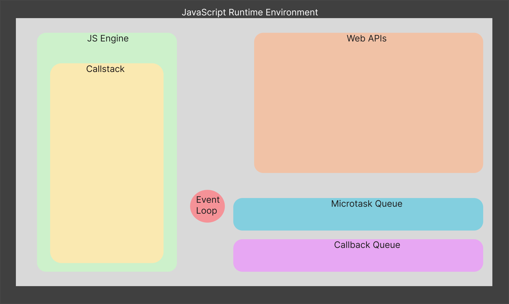
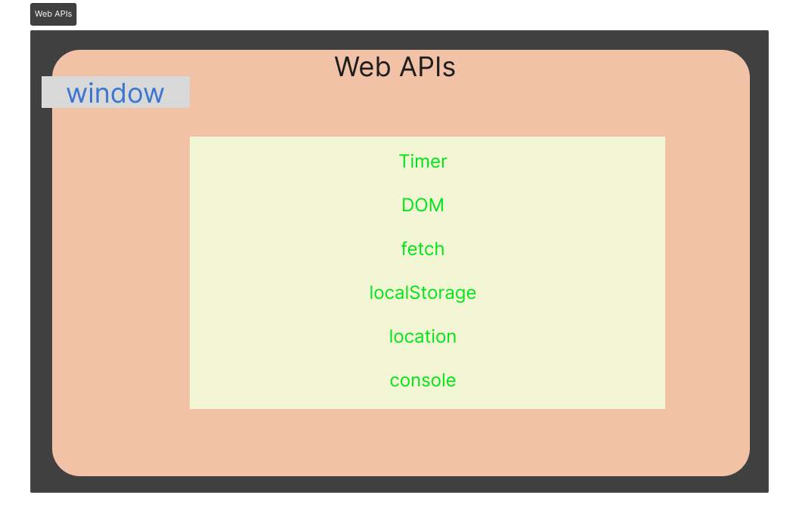

# Javascript

---

<details>
<summary>Index</summary>

- General
- variables  
- Scope
- JS Environment
- this Keyword
- Functions
- Built-in Higher-Order Array Methods
- Asynchronous
- Datatypes
- Code Working
- String Methods
- Array Methods
- DOM
</details>

---

<details>
<summary>General</summary>

##### What is Javascript?  
The JavaScript was created by Brendan Eich at Netscape.
JavaScript is known as the Scripting Language for Web pages.
JavaScript is a programming language used both on the client-side and server-side that allows you to make web pages interactive.
It improves the user experience of the web page by converting it from a static page into an interactive one (dynamic page).  
JavaScript is a scripting language.  
JavaScript code is run on a browser only


#####  Display Output

  ``` Javascript
// console
console.log("Hello World)

// textContent
let displayEl = document.getElementById("display");
displayEl.textContent = "Hello World";

// innerHTML
let displayEl = document.getElementById("display");
displayEl.innerHTML = <h1>Hello World</h1>;

// write
document.write("Hello World");

// alert
alert("Hello World")
  ```

##### Advantages
  - Server interaction is less.
  - Feedback to the visitors is immediate.
  - Interactivity is high.

</details>

---

<details>
<summary>Variables</summary>

### Variable

Variables are like containers. we can use these containers to store data during program execution. we can mention a name for identify a particular container. So
those named Containers are called variables. we can manipulate the data in the
containers by reffering that variable name.

we can store different types of data in the containers. In programming
languages, we have some categories in data,

Javascript supports various data types: 
1. number 
2. string
3. boolean
4. null
5. undefined


#### Define a Variable
In Javascript we can define a variable in 3 ways,

###### Declaration Keywords
1. var
2. let
3. const


### Rules of Define a Variable

##### syntax
``` javascript
Definition = Initialization
declarationKeyword variableName = value;
```

#### var
If a variable is declared inside a function, it is function-scoped. Else, it is global-scoped.  
If a variable declare using var, then initialization is not mandatory. This variable can be re-assigned and re-declared.

#### let 
If a variable is declared using let, then initialization is not mandatory. This variable can be re-assigned and it will have the block scope.
we can't re-declare the same variable.

const maintain constant values.

#### const 
If a variable is declared using const, then initialization is mandatory. Once the variable is initialized with a value, then it can't be re-assigned and it will have the block scope.

##### Differences between __var__, __let__ and __const__

| Declaration Keyword | Possible                                       | Not-Possible                  |
| ------------------- | ---------------------------------------------- | ----------------------------- |
| var                 | Initialization , Re-Assignment, Re-Declaration |                               |
| let                 | Initialization , Re-Assignment                 | Re-Declaration                |
| const               | Initialization                                 | Re-Assignment, Re-Declaration |

##### Memory Storage

Global Memory : __var__

Block Memory : __let, const__

#### Types of Variables

---
1. Local Variable
2. Global Variable
---
#### Local Variable
If a variable is created inside a block, that type of variable is called Local Variable.  


Example :
variable is created inside a function, When a function is called, its local variables are created, and when the function finishes it's executing, automatically those local variables are destroyed.  

Local variables are useful for temporary data storage within Block that should not interfere with other parts of the program. The Local Variable memory is created in the the Local Scope.
we can access these Local Variables only within that particular block of code.

#### Global Variable
If a variable is created outside of a block is called Global variable.
These Global Variables available upto end of the program execution.
The Global Variable memory is created in the global scope.
These Global Variables can be accessed at any part of the code.

#### Temporal Dead Zone

From Hoisting to assigns some value to the variable is called temporal dead zone.

##### Errors : 

###### SyntaxError
 Missing initializer in const declaration because it is a constant type already mentioned and declared.   
 Identifier 'a' has already been declared.

###### ReferenceError
When Javascript Engine tries to findout a specific variable inside the memory space and you can't access it.  
Cannot access 'a' before initialization  
c is not defined

###### TypeError 
Assignment to constant variable

</details>

---


<details>
<summary>Scope</summary>
Memory storage location is called scope.  

we have 2 scopes in Javascript  
1. Global Scope (Global + Script)
2. Block Scope
3. Local Scope (Function Scope)

In Global Level with declaration keywords let and const, It maintain seperate memory with script scope.


##### what is Block ?
Block is used to combine multiple Javascript statements into one group.  

Block is { }

Block memory will be deleted after Execution completed.  
Each Block has it's own Lexical scope.

`Example:`
```javascript

// single statement, so we dont't use block.
if (true) console.log("Hello world");

// here we are using multiple statements, so we use block.
if (true){
    var a = 10;
    console.log(a);
}

```
#### Closure

A function along with reference to its outer environment that together forms a Closure. 

Closure is a combination of a function and its lexical scope bundle together forms a Closure.

A closure gives the outer function's scope access to an inner function. 

Each and Every function in Javascript has access to its outer Lexical Environment that means use the varaibles and functions of its parent environment.

`Closure => local Memory + Lexical Environment of Parent`

**A closure is a function** that has access to its outer function scope even after the function has returned. Meaning, A closure can remember and access variables and arguments reference of its outer function even after the function has returned.

A function along with reference to its outer environment together forms a closure. Or in other words, A Closure is a combination of a function and its lexical scope bundled together.

##### Lexical Environment

Its Parent Memory

##### Uses of Closures
* Timer Functions
* Events
* Memoize 
* ...etc


##### Disadvantages of Closures
  * Over consumption of memory
  * Memory Leak
  * Freeze browser


##### Garbage Collector

Garbage collector is like program in the browser of the javascript engine,
It freez the un-utilized memory.
Garbage collector is do where the unused variables takes out of the memory.

</details>

---


<details>
<summary>JS Environment</summary>

 #### Javascript Runtime Environment

 ##### Components
 1. Code
 2. JS Runtime Environment
 3. JS Engine
 4. Web APIs
 5. Microtask Queue
 6. Callback Queue
 7. Event Loop 

#### Code


#### JS Runtime Environment


#### JS Engine


#### Web APIs



##### Execution Context


In Javascript, Everything happens inside an __Execution context__ .
The Execution context is like a big container.
Inside the Execution Context entire JavaScript code is executed. 
Execution Contex contains two components.

`Execution Context => Memory Component + code Component`

`Execution Context => Creation Phase + Execution Phase`


###### Phases of Execution Context

1. Memory phase
2. Code Phase


###### Memory Component (Variable Environment) 
In Memory Component all the variables and functions are stored as key-value pairs.
When the JavaScript engine allocates memory to a variable, it stores a special value `undefined` in it. In the case of functions, it stores the entire function inside the memory space.
`pair = key : value`

###### Code Component (Thread of Execution)

In code Component, variables in memory component take exact values of Javascript.

Code component is the place where code is executed one line at a time. It is also called the **Thread of Execution**.

JS is a **synchronous**, **single-threaded** language, which means that it can only execute one line of code at a time in a specific order. It can only move to the next line when the execution of the current line is completed.

Code is executed one line at a time. 

single-threaded -> javascript can run single line (one command) at a time.

synchronous -> Javascript can only Execute next line once current line execution is finished.


##### Callstack

Before you run Javascript code, the Global Execution context will be created.  

The execution context is created in two phases : 
  * Memory creation phase - JS will allocate memory to variables and functions.
  * Code execution phase

callstack plays a critical role in managing the execution of a program.

callstack handles, automatically create & delete operations of Execution Context.

When a function is invoked, a new execution context is added to the top of the call stack. Once the function execution is completed, its execution context is removed from the top of the call stack.


##### Hoisting

Hoisting is a JavaScript technique that moves variables and function declarations to the top of their scope before code execution begins.

Before Execution of the JS code, It create a Global Execution Context.

var keyword variables and function declarations are stored in Global Execution Context.

var keyword variable takes undefined as a default value.

If it is a Function Declaraion, It will be stored entire function.


</details>

---

<details>
<summary>this Keyword</summary>

 #### this keyword

##### Global space:

Any code write in javascript which is not inside a  function is called global space.

### window:
window object is created by javascript engine.
In window object we have lot of variables, methods and functions.
window object is a global object because it is created in the global space.
at the global level the window object is equal to __this__ object.

`window === this`


### this

In JavaScript, the this keyword always refers to an object.  
In Arrow Function, They inherit the __this__ value from their surrounding context.

The this keyword refers to the current execution context.  

In the global scope, this refers to the global object (window object in a browser context). 

Inside a method of an object, this refers to the object itself.

In Arrow functions, JavaScript sets the this lexically. This means that the arrow function doesn't create its own execution context but inherits the this from the outer function where the arrow function is defined.

</details>

---

<details>
<summary>Functions</summary>

##### Functions
Functions are heart ♥ of Javascript.

#### Types of Functions

1. Function Declaration
2. Function Expression
3. Arrow Function
4. Anonymous Function
5. Named Function
6. Callback Function
7. First Class Function
8. Higher Order Functions

```javascript
// Function Declaration

function a() {
	console.log('Function Declaration');
}

a();

```

```javascript
// Function Expression

// function acts like a value.
var a = function () {
	console.log('Function Expression');
};
a();

```


```javascript

// Arrow Function

// function acts like a value.
let a = () => {
	console.log('Arrow Function');
};

a();
```


```Javascript
// Anonymous Function
// A function without a name is called Anonymous Function.

var a = function () {
	console.log('Anonymous Function');
};

a();

// These anonymous functions are used at where functions used as values.


```

```javascript
// Named Function

// A function with name is called Named Function
var a = function b() {
	console.log('Named Function');
};

a();

```


###### Difference between __Parameter__ and __Argument__

```javascript

// 04 Difference between Parameters and Arguments

function a(parameter1, parameter2){
    console.log(parameter1, parameter2);
}


var argument1 = 10;
var argument2 = 20;

// The values which we pass to inside a function are known as arguments.
a(argument1, argument2);
```

###### Callback Function

pass a function as a parameter is called callback function.

###### First class Functions

we can send functions as arguments, we can use function as a values..etc

###### Higher Order Functions

DRY Principle => Don't Repeat Yoursely

</details>

---

<details>
<summary>Built-in Higher-Order Array Methods</summary>

 - map
 - forEach
 - filter
 - reduce
 - ...etc

`map`:

It creates a new array by applying a provided function to each element of an existing array and returns the results in a new array.

```javascript

let arr = [1, 2, 3, 4, 5];

function double(num){
    return num*2;
}

const output = arr.map((eachItem) => double(eachItem));
console.log(output);  // [2, 4, 6, 8, 10]

```

`forEach`:

The forEach method in JavaScript is used to iterate over the elements of an array and apply a provided function to each element. Its primary purpose is to perform an operation on each item in the array without creating a new array or modifying the original array

```Javascript

let arr = [1, 2, 3, 4, 5];

let newArray = [];

function double(num) {
	addValue = num * 2;
	newArray.push(addValue);
}

arr.map((eachItem) => double(eachItem));
console.log(newArray); // [2, 4, 6, 8, 10]


```

`filter`:
Creates a new array containing elements from the original array that satisfy a provided testing function. It returns a new array with the filtered elements.

```javascript
let arr = [1, 2, 3, 4, 5];

function even(num){
    return num % 2 === 0;
}

const output = arr.filter((eachItem) => even(eachItem));
console.log(output);  // [2, 4]
```

`reduce`:

The reduce method applies a provided function to reduce the elements of an array to a single value. It iterates through the array and accumulates a result by applying the provided function to each element and the current accumulator value.

```javascript
let arr = [1, 2, 3, 4, 5];

function sum(acc, curr){
    return acc + curr;
}

const output = arr.reduce((accumulator, currentValue) => sum(accumulator, currentValue), 0);
console.log(output); // 15 
```

</details>

---


<details>
<summary>Asynchronous</summary>
Javascript cannot wait for anyone.

Some Javascript tasks may take time to complete, such as  fetching data from External database,  perform tasks with timer, responding to user input.

JavaScript doesn't wait for these Operations to finish and instead moves on to execute other code.


1. Callback Queue
2. Microtask Queue

###### Callback Queue
The purpose of the Callback Queue is to manage and execute functions (callbacks) in a specific order, typically after some asynchronous operation has completed.

- setInterval
- setTimeout
- Events

Timer Events takes callback function attach the timer and when the timer expires then push into the Callback Queue.


###### Microtask Queue
fetch always return a Promise.  
we don't know how much of time take to __resolve__ or __reject__ the Promise. 

Q) what is a promise in Javascript?  
A) A Promise is an object representing the eventual completion or failure of an asynchronous operation.

- fetch
- Promise Object


```javascript
// create Own Promise


function createOrder(){
    const ownPromise = new Promise((resolve, reject) => {
        if (true){
            const err = new Error("Cart in not valid");
            reject(err);
        }
        else{
            const orderId = "12345";
            resolve(orderId);
        }
    });

    return ownPromise;
}

const promise = createOrder()
console.log(promise);

promise
.then((orderId) => console.log(orderId))
.catch((error) => {
    console.log(error.message);
});


```


###### Event Loop
Eventloop has just one job to keep checking callback queue and if found something push it to call stack and delete from callback queue.  

Event Loop continuosly monitoring the callstack,  
if callstack is empty then checks the Microtask Queue & callback Queue,  
if there is any Microtask functions or callback functions , it automatically push to the callstack.

Event Loop continuosly check wheter callstack is empty or not.

Here Microtask Queue has more priority than the Callback Queue.

</details>

---

<details>
<summary>Datatypes</summary>

##### Datatypes

1. __Primitive Datatypes__  
  Primitives are immutable.  Primitives are passed by value.
   - number
   - string
   - boolean
   - undefined
   - null
   

1. __Reference Datatype__   
  References are mutable.  References are passed by reference
   -  Arrays
   - Objects
   - NaN
  


##### undefined
If a value is not assigned to the variable, then it takes undefined as its value.  
undefined means a variable is declared but value is not assigned to that variable.  

variable is defined but It is using before Initialization.  

The datatype of undefined is undefined itself.

undefined is special keyword using for placeholder.
Variable is already initialized but javascript in the memory phase assigned a default value __undefined__.


##### not defined
we didn't declare a variable.
so memory is not allocated for that particular variable.

##### null
null can be assigned to a variable as a representation of no value. It is used
when we intentionally want a variable but don't need a value to it. The datatype of null is object. 

##### Data Structures

Data Structures allow us to store and organize data efficiently. This makes us access and performs operations on the data smoothly.

##### NaN
The NaN property represents Not-a-Number value. The typeof of a NaN returns a Number.

```Javascript 
isNaN(345); // returns false
isNaN(undefined); // returns true
```

</details>

---

<details>

<summary>String Methods</summary>

#### String Methods

</details>


---

<details>
<summary>Array Methods</summary>

#### Array Methods

  - push()
  - pop()
  - forEach()
  - map()
  - filter()
  - splice()
  - slice()
  - shift()
  - unshift()
  - sort()

</details>

---

<details>
<summary>DOM</summary>

#### DOM 

Document Object Model (DOM) is the structured representation of the HTML document created by the browser.  
It allows Javascript to manipulate, structure and style of our website.

##### Real DOM
Real DOM is nothing but DOM. DOM stands for Document Object Model. It is a structured representation of the HTML elements that are present in a webpage.
It represents the entire UI of your application.


##### Javascript DOM properties

   - classList
   - textContent
   - style

##### DOM manipulation
DOM manipulation is interacting with the DOM to modify the HTML document that is to be rendered on the web browser.

##### Events
  **Mouse Events** : mousedown, mouseup, click, dblclick, mousemove, mouseover, mousewheel, mouseout, contextmenu  
  **Touch Events** : touchstart, touchmove, touchend, touchcancel  
  **Keyboard Events** : keydown, keypress, keyup  
  **Form Events** : focus, blur, change, submit  
  **window Events** : scroll, resize, hashchange, load, unload  


  ##### preventDefault()
  ```Javascript
// Here in the form, it prevents the default behaviour of the submit event.
   event.preventDefault();
  ```
 

</details>

---

<details>
<summary>Storage</summary>

#### Storage

Client-Side Data Storage is storing the data on the client (user's machine).

  - Local Storage
  - Session Storage
  - Cookies
  - IndexedDB

##### localStorage
LocalStorage is limited to about 5MB and can contain only strings.
The Local Storage allows web applications to store data locally within the user's browser. It is a Storage Object. Data can be stored in the form of key-value pairs.


</details>


---

<details>
<summary>class</summary>

#### class

##### Inheritance
Inheritance is a mechanism by which a class inherits methods and properties from another class.

```javascript
class SuperClass {
  constructor(property1) {
    this.property1 = property1;
  }
  method1() {}
}
class SubClass extends SuperClass {
  constructor(property1, property2) {
    super(property1);
    this.property2 = property2;
  }
  method1() {}
}
let myObject = new SubClass(property1, property2);
```
</details>

---