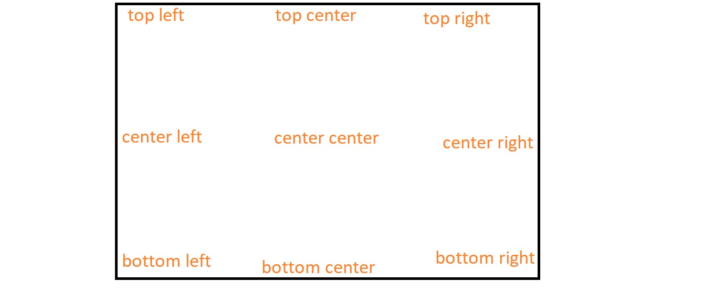
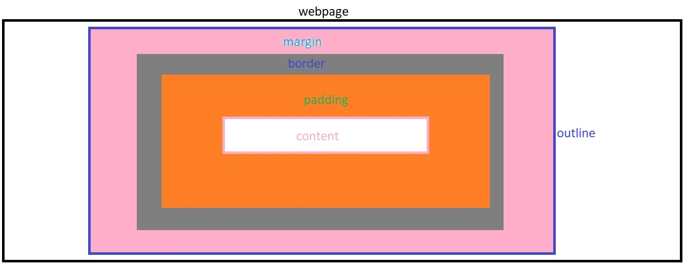

# CSS


<details>
<summary>Introduction</summary>

### Introduction
__CSS__ stands for __Cascading Style Sheets__  
* CSS used in web development to apply styles to the html document.
* We can create Responsive webpages by combining HTML & CSS.
* Once we create style sheet with .css file, we can use it for multiple .html files.


##### syntax
```CSS 
selector{
  property1:value1;
  property2:value2;
}
```

##### apply CSS

1. **Inline**  
by using the HTML `style` attribute in the HTML elements.
```HTML
<tag style="property1: value1; property2: value2; ...">Content</tag>
```

2. **Internal**  
by using the HTML `style` element in the HTML head element.
```HTML 
<!DOCTYPE html>
<html>
  <head>
    <style>
        .heading{
         color:"green";
         background-color:"orange"
        }
    </style>
  </head>
  <body>
    <h1 class="heading">content</h1>
  </body>
</html>
```
3. **External**  
   by using the HTML `link` element to link an external CSS file.  
   In External Style Sheet, CSS property-values are defined in a separate .css file.

```HTML 
<!DOCTYPE html>
<html>
  <head>
    <link rel="stylesheet" href="styles.css" />
  </head>
  <body>
    <h1 class="heading">content</h1>
  </body>
</html>
```

```CSS 
.heading{
    color:green;
    background-color:orange;
}
```
* The HTML __rel__ attribute stands for a relationship of the linked document to the current document. In this case, it is a stylesheet.
* The HTML __href__ attribute stands for the URL/path of the CSS file.
* 


##### Fundamental Concepts

* Inheritance
* Specificity
* Cascade

##### Inheritance
Children Inherits the Parent Property is called Inheritance.
```CSS 
.parent{
    color:blue;  /*  Inherited Property */
    border:2px black solid;  /*  Non-Inherited Property */
}
```

##### Specificity
Specificity is how browsers decide which CSS property values are the most relevant to an HTML element.

1. !important
2. Inline
3. Id
4. Class
5. Tag
6. Universal

##### Cascade
The source order of CSS Rulesets matters. when two CSS Rulesets have equal specificity, the one that comes last in the CSS is applied.

</details>

---

<details>
<summary>Selectors</summary>

### Selectors
The CSS Selectors are used to select the HTML elements that we want to style.

1. Tag selector = same kind of tags selection
2. Id selector = only one particular element  selection
3. Class selector = group of elements selection
4. Attribute selector
5. Pseudo selector
6. Mixed selector 
7. Group selection
8. Universal Selector 

##### Specificity
CSS Specificity is how browsers decide which CSS property values are the most relevant to an HTML element and apply those CSS property values to the HTML element.  

selector priority from High to Low:  

1. !important
2. inline styles
3. id selector
4. class selector
5. tag selector
6. Universal selector


##### Tag Selector
```HTML 
 <p>I am Tag Selector</p>
 <p>I am Tag Selector</p>
 <p>I am Tag Selector</p>
```

```CSS 
p{
    color:red;
    background-color: yellow;
}
```

##### Id Selector
```HTML 
 <p id="myParagraph">I am ID Selector</p>
 <p>I am Tag Selector</p>
 <p>I am Tag Selector</p>
```

```CSS 
#myParagraph{
    color:red;
    background-color: yellow;
}
```

##### class Selector
We can provide multiple class names separated by space as a value to the HTML class attribute.
`<tag class="name1 name2 name3 name4 ...">Content</tag>`

```HTML 
 <p id="myParagraph">I am ID Selector</p>
 <p class="my-paragraph">I am Tag Selector</p>
 <p class="my-paragraph">I am Tag Selector</p>
```

```CSS 
.my-paragraph{
    color:red;
    background-color: yellow;
}
```

##### Attribute Selector

```HTML 
<input type="text" placeholder="textbox">

<input type="password" placeholder="password">
```

```CSS 

input[type]{
    padding:10px;
    border-radius: 10px;
}

input[type="password"]{
    background-color: orange;
}
```

##### Psedo selector
psedo selector is a dynamic selector  
`selector:event`

```HTML 
 <h1 class="heading-element">Please put cursor on me</h1>

    <input class="textbox" type="text" placeholder="please focus on me"/>
```

```CSS 
.heading-element:hover{
    box-shadow:0 0 10px black;
}

.textbox:focus{
    box-shadow: 0 0 10px black;
}

```

##### Mixed Selector

```HTML 
  <div class="parent">
        <h1 class="child">I am First Child</h1>
        <h1>I am Second Child</h1>
    </div>
```

```CSS 
.parent .child{
    padding:10px;
    color:orange;
    background-color: green;
    border-radius: 10px;
}
```

##### Group Selection

```HTML 
  <h1 class="class-heading">Class Selection</h1>
  <h1 id="id-heading">Id Selection</h1>
```

```CSS 
.class-heading, #id-heading{
    padding: 10px;
    background-color: green;
    border-radius: 10px;
    box-shadow: 0 0 10px black;
}
```

##### Universal Selector
The universal selector selects all the HTML elements in an HTML document.  

```HTML 
<div>1</div>
<div id="myBox">2</div>
<div class="my-box">3</div>
```

```CSS 
* {
    color: orange;
}
```

</details>

---

<details>
<summary>Properties</summary>

### Properties

1. Alignment
2. Text Properties
3. Background Properties
4. Box Properties
5. Gradients
6. Handling Overflow
7. Flexbox
8. Media Queries
9. Positions
10. Table

</details>

---

<details>
<summary>Alignment</summary>

### Alignment
`text-align` property specifies the horizontal alignment of the text in an HTML element.

  - `text-align:left;`
  - `text-align:center;`
  - `text-align:right;`

</details>

---

<details>
<summary>Text Properties</summary>

### Text Properties

##### color
* `color:"orange";`
* `color:#ffffff`

##### font styles
* `font-family:"Roboto";`
* `font-size: 28px;`
* `font-style:italic;`
* `font-weight:bold;`
* `text-decoration: underline;`
* `text-transform: uppercase;`

##### text spacing
* `text-indent: 200px;`
* `letter-spacing:5px;`
* `line-height: 10px;`
* `word-spacing: 20px;`

##### text shadow
* `text-shadow:0 0 3px red;`

</details>

---

<details>
<summary>Background Properties</summary>


### Background Properties

1. background-color
2. background-image
3. background-repeat
4. background-attachment
5. background-position
6. background-size


##### background-color
  * `background-color: "orange";`
  * `background-color: transparent;`

##### background-image
  * `background-image: url("source/bg-image.jpg");`
  * `linear-gradient(45deg,black,red,green);` 
  * `linear-gradient(to left,black,red,green);` 
  * `radial-gradient(black,red,green);`

##### background-repeat
   * `background-repeat:repeat;`
   * `background-repeat:no-repeat;`
   * `background-repeat:repeat-x;`
   * `background-repeat:repeat-y;`

##### background-attachment   
   * `background-attachment: scroll;`
   * `background-attachment: fixed;`

##### background-position
   `background-position: top left;`
   

##### All Backgrounds Shortcut
```CSS
shortcut{
background:color image repeat attachment position;
}
```
  * `background:red url("./source/lion.jpg") no-repeat scroll center center;`
 

##### background-size
  `background-size:cover;`

</details>

---

<details>
<summary>Box Properties</summary>

### Box Properties
1. width & height
2. border
3. padding
4. margin
5. outline



### CSS Box Model

* __Content__ - The content of the box, where text and images appear.
* __Padding__ - A transparent space between the content and the border.
* __Border__ - A borderline that goes around the padding and content. 
* __Margin__ - A transparent space outside the border.

##### Intrinsic vs Extrinsic
* some elements have a natural size set by default, we call it Intrinsic size.
* If we set a specific size to an element, we call an Extrinsic size.

##### width & height
It gives HTML element width & height
  * `width:100px;`
  * `height:100px;`
  * `min-width:100px;`
  * `max-width:400px;`
  * `min-height:100px;`
  * `max-height:400px;`

##### border
   * `border-style: dashed;`
   * `border-width: 5px;`
   * `border-color: orange;`
   * border shortcut
     - `border:styleName width color;`
     - `border: 5px dashed orange;`
        - ``border-left:5px solid greenyellow;``
   * `border-radius:10px;`
      - `border-top-right-radius:10px;`
   * supporting properties
     - top
     - right
     - bottom
     - left

##### padding
The space between border and content.
   * `padding:10px;`(TRBL)
   * `padding-top:10px;`
   * `padding-right:10px;`
   * `padding-bottom:10px;`
   * `padding-left:10px;`

##### margin
The space between border and outline
 * `margin:auto;`
 * `margin:50px;`(TRBL)
 * `margin-top: 50px;`
 * `margin-right:50px;`
 * `margin-bottom: 50px;`
 * `margin-left: 50px;`

##### outline
* `outline-style: dashed;`
* `outline-width: 5px;`
* `outline-color: orange;`
* border shortcut
  - `outline:styleName width color;`
  - `outline: 5px dashed orange;`
     - `outline-left:5px solid greenyellow;`
* supporting properties
  - top
  - right
  - bottom
  - left

##### Box-sizing property
The box-sizing CSS property sets how the total width and height of an element are calculated.

Box-Sizing property has the following values:
1. content-box (default)
2. border-box


* __content-box__: (Default) The width and height properties include only content, but they do not include the padding, border, or margin.

```CSS 
.container {
  width: 160px;
  height: 80px;
  padding: 20px;
  margin: 10px;
  border: 8px solid red;
  box-sizing: content-box;

  /* Total width: 160px + (2 * 20px) + (2 * 8px) = 216px
     Total height: 80px + (2 * 20px) + (2 * 8px) = 136px
     Content box width: 160px
     Content box height: 80px */
}
```
* __border-box__: The width and height properties include the content, padding, and border, but they do not include the margin.

```CSS 
.container {
  width: 160px;
  height: 80px;
  padding: 20px;
  margin: 10px;
  border: 8px solid red;
  box-sizing: content-box;

  /* Total width: 160px
     Total height: 80px
     Content box width: 160px - (2 * 20px) - (2 * 8px) = 104px
     Content box height: 80px - (2 * 20px) - (2 * 8px) = 24px */
}
```

##### Box Shadow
* `box-shadow:x y blur color;`
* `box-shadow:0 0 10px black;`

</details>

---

<details>
<summary>Handling Overflow</summary>

### Handling Overflow

content overflow can be handled using the CSS overflow property.
overflow : child element is not overflowed on parent element.

1. visible (default)=> CSS tries to avoid data loss. Hence, the `overflow:visible;` is the default value for it.
   * `overflow:visible;`
2. hidden => The overflow is clipped, and the rest of the content will be invisible.
   * `overflow: hidden;`
3. scroll => The overflow is clipped, and a scrollbar is added to see the rest of the content.
   *  `overflow: scroll;`
   *  `overflow-x: scroll;`
   *  `overflow-y: scroll;`
4. auto => It is similar to scroll, but it adds scrollbars only when necessary.
  *  `overflow: auto;`

</details>

---

<details>
<summary>Flexbox</summary>

### Flexbox

##### Layout
A Layout is a pattern to structure the information and arrange the elements on the website.  
Methods to Design a Layout:  
Mainly, there are two methods that help design the webpage layout.

1. Flexbox(stable)
2. CSS Grid(Advanced & Fast growing but not stable)


##### Flexbox
Flexbox is a layout method that helps to arrange the HTML elements in rows(harizontally) or columns(vertically).  
A responsive website will automatically adjust for different screen sizes and viewports.
Flexbox Layout with CSS Properties:
* display
  - flex
  - inline-flex
  - grid
  - none
* flex-direction
  - The Flex Direction specifies the direction of the flex items in the Flexbox Container.
  - row
  - column
* justify-content
  - The justify-content property specifies the alignment of flex items along the main axis.
  - justify content property can have the following values:
    - flex-start (default)=> All the elements will arrange to the start of the container.
    - center => All the elements will arrange to the center of the    container.
    - flex-end => All the elements will arrage to the end of the    container.
    - space-between => Left over space will be arrange in between the  flex items.
    - space-around => Every flex item will get space around them.
* align-items
  - The align-items property specifies the alignment of flex items along the cross-axis.
  - Align items property can have the following values:

     - stretch (default)=> will stretch its available height.
     - flex-start => will be at the starting of the flex container.
     - center => will be at the center of the available height.
     - flex-end => will be at the ending point of the available height.
* flex-wrap
  - The flex-wrap property arranges the flex items in multiple lines.
  - Flex wrap property can have the following values:
    - nowrap(default)
    - wrap
    - wrap-reverse

* align-self
   - The align self property specifies the alignment of individual flex items along the cross axis.
   - Align self property can have following values:

      - flex-start
      - center 
      - flex-end
      - stretch
      - auto(default)

If the value of align-self is auto, then the align-items value of its Flex container gets inherited.

* order
  - The order property specifies the order of flex items in the Flex container.

  - order property has the following values:

    - 0 (default)
    - +ve values
    - -ve values


##### Block vs Inline
* The block-level element always starts on a new line.
It always takes up the full width available

* The inline element does not start on a new line.
It only takes up as much width as necessary.
</details>

---

<details>
<summary>Media Queries</summary>

### Media Queries

##### Responsiveness 
 perfectly fit for all the different screen sizes.

##### Media Query
Media queries play a crucial part while developing Responsive Layouts.
We can create a responsive website using media queries or flexbox without Bootstrap.
Using Media queries, we can conditionally apply styles based on the device type (e.g. printers, TVs, etc.) and media features (e.g. viewport width, etc.).

##### syntax:

```CSS 
@media media-type and (media-feature-expression){

/* CSS rules go here */

}
```

* __Media Type__: Media type describes the general category of devices. Possible types of media are screen, print, tv, all, etc.  
* __Media Feature__: Using Media Features, we can write Media Query for a specific feature. Examples: width, height, orientation, etc.

##### Media Types 
possible types of media are:
* screen => For all screened devices (mobile, laptops, tablets, ...etc)
* print = For printers
* tv => For Televisions
* all => Matches all types of devices and more...

##### screen
```CSS
@media screen and (max-width: 800px) {
    .bg-container {
        background-color: deepskyblue;
    }
}

@media screen and (max-width: 799px) {
    .bg-container {
        background-color: orange;
    }
}

@media screen and (min-width: 801px) {
    .bg-container {
        background-color: yellowgreen;
    }
}
```

##### Logica Operators
* and
* not
* comma

###### and

using and operator can combine mutiple Media Features.  
syntax:

```CSS
@media (media-feature-expression) and (media-feature-expression){
/* CSS rules go here */
}
```

we can also join media feature with a media type.
syntax:  

```CSS 
@media media-type and (media-feature-expression){
/* CSS rules go here */
}
```

##### not
The not operator is a Media Query Modifier. It negates the entire Media Query result.
If you use the not operator, you must also specify a media type.

syntax:

```CSS 
@media not screen and (min-width:600px){
	/* CSS rules go here */
}
```

##### comma
Using ,(comma) operator we can combine multiple Media Queries.
```CSS 
@media (orientation: landscape), (min-width: 600px) {
    .bg-container {
        background: yellowgreen;
    }
}
```


##### Orientation

The two most common types of orientation are:

landscape => The width of the device is greater than the height.
portrait => The height of the device is greater than the width.

```CSS 

@media (orientation: landscape) {
    .bg-container {
        background-color: orange;
    }
}

@media (orientation: portrait) {
    .bg-container {
        background-color: yellowgreen;
    }
}
```

##### print
```CSS 
@media print {
    .heading {
        color: green;
    }
}
```

</details>

---

<details>
<summary>Positions</summary>

### Positions

##### position properties 
1. `position:static;`
2. `position:relative;`
3. `position:absolute;`
4. `position:fixed;`
5. `position:sticky;`
   
---

* __static__ => default position of any html element 
* __relative__ => this positioned relative to its own
* __absolute__ => this is positioned relative to its parent
* __fixed__ => this is to fix an element in the given position
* __sticky__ => this is to stick an element in the given position

##### supporting properties:
`top,right,bottom,left`

##### z-index
z-index =>  layers position  
`z-index:1;`

```CSS 
.selector{
    background-color:yellow;
    position:absolute;
    left:20px;
    top:20px;
    z-index:4;
}
```
</details>

---

<details>
<summary>CSS Units</summary>

### CSS Units

* pixel : pixels are fixed size
  - `width:100px;`
* viewport : view port is depended on device size
  -  `width:100vw;`
  -  `width:100vh;`
* percentage : percentage is depended on parent container
  - `width:100%;`

</details>

---

<details>
<summary>CSS Custom Property</summary>

### CSS Custom Property
A CSS custom property is most commonly thought of as a variable in CSS.

* variable creation : --variable
* use variable : var(--variable)

```CSS 
.card {
  --spacing: 2px;
  padding: var(--spacing);
  margin-bottom: var(--spacing);
}
```

If the custom property has to be accessed through the entire HTML document, declare it inside the :root pseudo-class.

```CSS 
:root {
  --main-bg-color: brown;
}

.card-1 {
  color: white;
  background-color: var(--main-bg-color);
}
```

</details>

---


<details>
<summary>CSS Animation</summary>

### CSS Animation

To create animations using CSS, you can use the __@keyframes__ rule along with CSS properties like 

1. `animation-name:anyName;`
2. `animation-duration:3s;`
3. `animation-iteration-count:1 / infinite;` => reputation
4. `animation-timing-function:linear / ease-in / ease-out;`
5. `animation-delay:3s;`

```CSS 
shortcut{
animation:name duration iteration-count timing-function delay;
}
```

##### procedure
step1 => define your element
step2 => apply animation rules


First, define your animation using @keyframes:

```CSS 
.myAnimation:hover{
    animation:animationEffects 2s infinite linear 1s;
}
```

```CSS 
@keyframes animationEffects {
    0%{
        transform:rotate(0deg);
        border:solid 8px green;
    }

    50%{
        transform:rotate(180deg);
        border:solid 8px red;
    }

    100%{
        transform:rotate(360deg);
        border:solid 8px blue;
    }
}
```

</details>

---