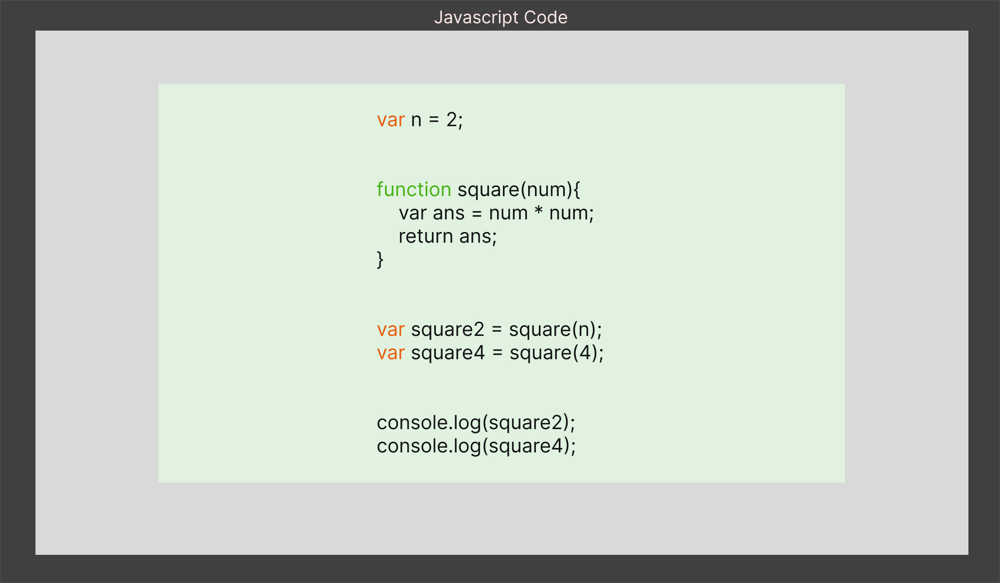

# Javascript

---

<details>
<summary>Index</summary>

### Index

- General
- variables  
- Scope
- JS Environment
- this Keyword
- Functions
- Built-in Higher-Order Array Methods
- Asynchronous
- Datatypes
- Code Working
- String Methods
- Array Methods
- DOM
</details>

---

<details>
<summary>General</summary>

### General

##### What is **Javascript**?  
**JavaScript** is a scripting language for web pages.  
we can also use Javascript on server-side as NodeJS.

we can create Dynamic Webpages by combinning HTML & Javascript.

#####  Display Javascript Output

  ```Javascript
// console
console.log("Hello World");

// textContent
let myElement = document.getElementById("myElement");
myElement.textContent = "Hello World";

// innerHTML
let myElement = document.getElementById("myElement");
myElement.innerHTML = <h1>Hello World</h1>;

// write
document.write("Hello World");

// alert
window.alert("Hello World");
  ```

##### Advantages
  - Server interaction is less.
  - Immediate response to the users.

</details>

---

<details>
<summary>Variables</summary>

### Variable

Variables are like containers. we can use these containers to store data during program execution. we can mention a name for identify a particular container. So those named Containers are called variables. we can manipulate the data in the containers by reffering that variable name.

we can store different types of data in the containers. In programming languages, we have some categories in data.

Javascript supports various data types: 
1. number 
2. string
3. boolean
4. null
5. undefined


#### Define a Variable
In Javascript we can define a variable in 3 ways,

###### Declaration Keywords
1. var
2. let
3. const


#### Rules of Define a Variable

##### syntax
```
Definition = Initialization
declarationKeyword variableName = value;
```

#### var
If a variable declare using var, then initialization is not mandatory. This variable can be re-assigned and re-declared.  
If a variable is declared inside a function, it is function-scoped. Else, it is global-scoped.

#### let 
If a variable is declared using let, then initialization is not mandatory. This variable can be re-assigned.  
we can't re-declare the same variable.

#### const 
If a variable is declared using const, then initialization is mandatory. Once the variable is initialized with a value, then it can't be re-assigned.  
const variable maintain constant values.

##### Differences between __var__, __let__ and __const__

| Declaration Keyword | Possible                                       | Not-Possible                  |
| ------------------- | ---------------------------------------------- | ----------------------------- |
| var                 | Initialization , Re-Assignment, Re-Declaration |                               |
| let                 | Initialization , Re-Assignment                 | Re-Declaration                |
| const               | Initialization                                 | Re-Assignment, Re-Declaration |

##### Memory Storage

Global Memory : __var__

Block Memory : __let, const__

#### Types of Variables


1. Local Variable
2. Global Variable


#### Local Variable
If a variable is created inside a block, that type of variable is called Local Variable.  


*Example* :  
variable is created inside a function, When a function is called, its local variables are created, and when the function finishes it's executing, automatically those local variables are destroyed.  

Local variables are useful for temporary data storage within Block that should not interfere with other parts of the program. The Local Variable memory is created in the the Local Scope.
we can access these Local Variables only within that particular block of code.

#### Global Variable
If a variable is created outside of a block is called Global variable.
These Global Variables available upto end of the program execution.
These Global Variables can be accessed at any part of the code including Functions also.  
The Global Variable memory is created in the global scope.


##### Temporal Dead Zone
A block's temporal dead zone starts at the beginning of the block's local scope. It ends when the computer fully initializes your variable with a value.  
From Hoisting to assigns some value to the variable is called temporal dead zone.  

we can't access the variables, when Variable in **TDZ**

```Javascript 
{
  // myVar TDZ starts here (at the beginning of this block's local scope)
  // myVar TDZ continues here
  // myVar TDZ continues here
  console.log(myVar); // returns ReferenceError because myVar continues here
  // myVar TDZ continues here
  // myVar TDZ continues here
  let myVar = "Vegetable Fried Rice"; // bestFood's TDZ ends here
  // myVar TDZ does not exist here
  // myVar TDZ does not exist here
}
```

#### Errors
Errors are 2 types:
1. syntaxError
2. Runtime Error

##### SyntaxError
 Missing initializer in const declaration because it is a constant type already mentioned and declared.  
 Identifier 'a' has already been declared.  
 If we are not folloing rules of language, then we got syntax error.

##### Runtime Error
* ###### ReferenceError
   * When Javascript Engine tries to findout a specific variable    inside the memory space but that variable does not exist in the    memory space.
   * Cannot access 'a' before initialization .   
   * 'c' is not defined.  


* TypeError 
   * Assignment to constant variable.  
   * A Type error can be thrown when we try to make an operation on the incorrect data type.

</details>

---

<details>
<summary>Scope</summary>
Memory storage location is called scope.  

we have 3 scopes in Javascript  
1. Global Scope (Global + Script)
2. Block Scope
3. Local Scope (Function Scope)

In Global Level with declaration keywords **let** and **const**, It maintain seperate memory with script scope.  


##### what is Block ?
Block is used to combine multiple Javascript statements into one group.  

Block is { }

Block memory will be deleted after Execution completed.  
Each Block has it's own Lexical scope.

```javascript

// single statement, so we dont't use block.
if (true) console.log("Hello world");

// here we are using multiple statements, so we use block.
if (true){
    var a = 10;
    console.log(a);
}

```
#### Closure

**Closure** is a combination of a function and its lexical scope bundle together forms a Closure.

A closure gives the outer function's scope access to an inner function that means it can be used the varaibles and functions of its parent environment.. 

`Closure => local Memory + Lexical Environment of Parent`


##### Lexical Environment

Its Parent Memory

##### Uses of Closures
* Timer Functions
* Events
* ...etc


##### Disadvantages of Closures
  * Over consumption of memory
  * Memory Leak
  * Freeze browser


##### Garbage Collector

Garbage collector is like program in the browser of the javascript engine.

Garbage collector is do where the unused variables takes out of the memory.

</details>

---

<details>
<summary>JS Environment</summary>

 ### Javascript Runtime Environment

 ##### Components
 1. Code
 2. JS Runtime Environment
 3. JS Engine
 4. Web APIs
 5. Microtask Queue
 6. Callback Queue
 7. Event Loop 

#### Code


#### JS Runtime Environment


#### JS Engine


#### Web APIs


##### Execution Context


In Javascript, Everything happens inside an __Execution context__ .
The Execution context is like a big container.
Inside the Execution Context entire JavaScript code is executed. 
Execution Contex contains two components.

`Execution Context => Memory Component + code Component`

`Execution Context => Creation Phase + Execution Phase`


###### Phases of Execution Context

1. Memory phase
2. Code Phase


###### Memory Component (Variable Environment) 
In Memory Component all the variables and functions are stored as key-value pairs.
When the JavaScript engine allocates memory to a variable, it stores a special value `undefined` in it. In the case of functions, it stores the entire function inside the memory space.
`pair = key : value`

###### Code Component (Thread of Execution)

Code component is the place where code is executed one line at a time. It is also called the **Thread of Execution**.

In this phase, variables in memory component will be initialized.

JavScript is a **synchronous**, **single-threaded** language, which means that it can only execute one line of code at a time in a specific order. It can only move to the next line when the execution of the current line is completed.

single-threaded -> javascript only execute single line (one command) at a time.

synchronous -> Javascript execute next line when once current line execution is finished.

##### Callstack

Before execute the Javascript code, the Global Execution context will be created.  

The execution context is created in two phases : 
  * Memory creation phase - JS will allocate memory to variables and functions.
  * Code execution phase

callstack plays an important role in managing the execution of a program.

callstack handles, automatically create & delete operations of Execution Context.

When a function is invoked, a new execution context is added to the top of the call stack. Once the function execution is completed, its execution context is removed from the top of the call stack.


##### Hoisting

Hoisting is a JavaScript technique.

Before Execution of the JS code, It create a Global Execution Context.

var keyword variables and function declarations are stored in Global Execution Context.

var keyword variable takes undefined as a default value.

If it is a Function Declaraion, It will be stored entire function.


</details>

---

<details>
<summary>this Keyword</summary>

 ### this keyword

##### Global space:

Any code write in javascript which is not inside a  function is called global space.

### window:
window object is created by javascript engine.
In window object we have lot of variables, methods and functions.
window object is a global object because it is created in the global space.
at the global level the window object is equal to __this__ object.

`window === this`


##### this

In JavaScript, __this__ keyword always refers to an current object.  

In Arrow Function, They inherit the __this__ object from their surrounding context. 

In the global scope, this refers to the global object. 
`window === this`  

Inside a method of an object, this refers to the object itself.

##### this methods

we can manipulate the __this__ keyword with below methods.

* call
* apply 
* methods

###### call  
With __call__ we can invoke a method passing an owner object as an argument.

```Javascript 
const person1 = {
    name: 'Praveen',
    surname: 'Ande',
    sayName: function() {
        return this.name + " " + this.surname;
    }
}

const person2 = {
    name: 'Brenden',
    surname: 'Eich'
}

console.log(person1.sayName.call(person2));  // Brenden Eich
```

###### apply  
The apply method works very similarly to call. The only difference between them is that call accepts parameters as a list separated by colons, and apply accepts them as an array.

```Javascript 
const person1 = {
    name: 'Pedro',
    surname: 'Sanchez',
    sayName: function(city, country) {
        return this.name + " " + this.surname + ", " + city + ", " + country;
    }
}

const person2 = {
    name: 'Jimena',
    surname: 'Juarez'
}

console.log(person1.sayName.apply(person2, ["DF", "Mexico"]));
```

###### bind
Same as call and apply , the bind method indicates the object to which the this keyword will refer when a given method executes.

But the difference with bind is that it will return a new function, without executing it. While with call and apply the function executed right away, using bind we must execute it separately.

```Javascript 
const person1 = {
    name: 'Pedro',
    surname: 'Sanchez',
    sayName: function() {
        return this.name + " " + this.surname
    }
}

const person2 = {
    name: 'Jimena',
    surname: 'Juarez'
}

const sayPerson2Name = person1.sayName.bind(person2)

console.log(sayPerson2Name())
```

</details>

---

<details>
<summary>Functions</summary>

##### Functions
Functions are heart ♥ of Javascript.

A JavaScript Function is a block of code designed to perform a particular task. A JavaScript function is executed when calls it.

We can define the code once, and use it many times. We can use the same code many times with different arguments, to produce different results (We can reuse code ).

#### Types of Functions

1. Function Declaration
2. Function Expression
3. Arrow Function
4. Anonymous Function
5. Named Function
6. Callback Function
7. First Class Function
8. Higher Order Functions

```javascript
// Function Declaration

function a() {
	console.log('Function Declaration');
}

a();

```

```javascript
// Function Expression

// function acts like a value.
let a = function () {
	console.log('Function Expression');
};
a();

```


```javascript

// Arrow Function

// function acts like a value.
let a = () => {
	console.log('Arrow Function');
};

a();
```


```Javascript
// Anonymous Function
// A function without a name is called Anonymous Function.

var a = function () {
	console.log('Anonymous Function');
};

a();

// These anonymous functions are used at where functions used as values.


```

```javascript
// Named Function

// A function with name is called Named Function
var a = function b() {
	console.log('Named Function');
};

a();

```

###### Difference between __Parameter__ and __Argument__

```javascript

// we run the function with parameters
function a(parameter1, parameter2){
    console.log(parameter1, parameter2);
}


var argument1 = 10;
var argument2 = 20;

// we call the function with arguments
a(argument1, argument2);
```

###### Callback Function

pass a function as a parameter is called callback function.

###### First class Functions

we can send functions as arguments, we can use function as a values..etc

###### Higher Order Functions
These Functions follows DRY Principle..  
DRY Principle => Don't Repeat Yourself


##### Over Ridding

When we define the multiple functions with the same name, then the last defined one will be called. It is called Function Overriding.

JavaScript supports Function Overriding.

</details>

---

<details>
<summary>Built-in Higher-Order Array Methods</summary>


### Built-in Higher-Order Array Methods
 - map
 - forEach
 - filter
 - reduce

##### map

It creates a new array by applying a provided function to each element of an existing array and returns the results in a new array.

```javascript

let arr = [1, 2, 3, 4, 5];

function double(num){
    return num*2;
}

const output = arr.map((eachItem) => double(eachItem));
console.log(output);  // [2, 4, 6, 8, 10]

```

##### forEach

The forEach method in JavaScript is used to iterate over the elements of an array and apply a provided function to each element. Its primary purpose is to perform an operation on each item in the array without creating a new array or modifying the original array

```Javascript

let arr = [1, 2, 3, 4, 5];

let newArray = [];

function double(num) {
	addValue = num * 2;
	newArray.push(addValue);
}

arr.forEach((eachItem) => double(eachItem));
console.log(newArray); // [2, 4, 6, 8, 10]


```

##### filter  
Creates a new array containing elements from the original array that satisfy a provided testing function. It returns a new array with the filtered elements.

```javascript
let arr = [1, 2, 3, 4, 5];

function even(num){
    return num % 2 === 0;
}

const output = arr.filter((eachItem) => even(eachItem));
console.log(output);  // [2, 4]
```

##### reduce

The reduce method applies a provided function to reduce the elements of an array to a single value. It iterates through the array and accumulates a result by applying the provided function to each element and the current accumulator value.

```javascript
let arr = [1, 2, 3, 4, 5];

function sum(acc, curr){
    return acc + curr;
}

const output = arr.reduce((accumulator, currentValue) => sum(accumulator, currentValue), 0);
console.log(output); // 15 
```

</details>

---


<details>
<summary>Asynchronous</summary>

### Asynchronous  

Javascript cannot wait for anyone.

Some Javascript tasks may take time to complete, such as  
* fetch -> fetching data from External database,  
* timer -> perform tasks with timer
* Events -> responding to user input.

JavaScript doesn't wait for these Operations to finish and instead moves on to execute other code.

1. Callback Queue
2. Microtask Queue

##### Callback Queue
The purpose of the Callback Queue is to manage and execute functions (callbacks) in a specific order, typically after some asynchronous operation has completed.

- setInterval
- setTimeout
- Events

Timer Events takes callback function attach the timer and when the timer expires then push into the Callback Queue.


###### Microtask Queue
fetch always return a Promise.  
A Promise is an object representing the eventual completion or failure of an asynchronous operation.  
we don't know how much of time take to __resolve__ or __reject__ the Promise. 

- fetch
- Promise Object


```javascript
// create Own Promise

function createOrder(){
    const ownPromise = new Promise((resolve, reject) => {
        if (true){
            const err = new Error("Cart in not valid");
            reject(err);
        }
        else{
            const orderId = "12345";
            resolve(orderId);
        }
    });

    return ownPromise;
}

const promise = createOrder()
console.log(promise);

promise
.then((orderId) => console.log(orderId))
.catch((error) => {
    console.log(error.message);
});


```

##### Event Loop

Event Loop continuosly monitoring whether callstack is empty or not.  
if callstack is empty then checks the Microtask Queue & callback Queue. 
if there is any Microtask functions or callback functions , it automatically push it to the callstack delete from queue.  

Here Microtask Queue has more priority than the Callback Queue.

</details>

---

<details>
<summary>Datatypes</summary>

##### Datatypes

1. __Primitive Datatypes__  
  Primitives are immutable.  Primitives are passed by value.
   - number
   - string
   - boolean
   - undefined
   - null
   

1. __Reference Datatype__   
  References are mutable.  References are passed by reference
   -  Arrays
   - Objects
   - Maps
   - Sets
   - NaN

##### undefined
If a variable already is already declared, but value is not assigned to that variable, then it takes undefined as its value.

variable is defined but It is using before Initialization.  

The datatype of undefined is undefined itself.

undefined is special keyword using for placeholder.
Variable is already initialized but javascript in the memory phase assigned a default value __undefined__.


##### not defined
we didn't declare a variable.
so memory is not allocated for that particular variable.

##### null
null can be assigned to a variable as a representation of no value. 
It is used when we intentionally want a variable but don't need a value to it.   
The datatype of null is object. 

##### Data Structures

Data Structures allow us to store and organize data efficiently. This makes us access and performs operations on the data smoothly.

##### NaN
The NaN property represents Not-a-Number value. The typeof of a NaN returns a Number.

```Javascript 
isNaN(345); // returns false
isNaN(undefined); // returns true
```

</details>

---

<details>

<summary>String Methods</summary>

#### String Methods

- split
- trim
- replace

* **split**  
  The split method is used to split a string into an array of substrings and returns the new array.  
  `string.split(separator)`

* **trim**  
* We use the trim method to remove whitespace from both ends of a string.

* **replace**
  `string.replace(searchValue, replaceValue)`

```Javascript
const greeting = "   Hello world!  ";
console.log(greeting);
console.log(greeting.trim()); // Output: Hello world!
```

</details>


---

<details>
<summary>Array Methods</summary>

##### Array
An Array holds an ordered sequence of items. 

##### Array Methods

  - push()
  - pop()
  - forEach()
  - map()
  - filter()
  - splice()
  - slice()
  - shift()
  - unshift()
  - sort()
  - join


* **join**
  The join method returns the array as a string. The elements will be joined by a specified separator.  
  `arr.join(separator)`

* **push**
  The push method adds new items to the end of the array.


* **slice**
  The slice method returns the selected elements in an array, as a new array.
  `arr.slice(startIndex, endIndex)`  

  ```Javascript
  let fruits = ["Banana", "Orange", "Lemon", "Apple", "Mango"];

  let citrus = fruits.slice(1, 3);

    console.log(citrus); // Output: ["Orange", "Lemon"]
   console.log(fruits); // Output: ["Banana", "Orange", "Lemon", "Apple", "Mango"]
  ```  

</details>

---

<details>
<summary>Object</summary>

### Object

##### Object Destructuring
To unpack properties from Objects, we use Object Destructuring. The variable name should match with the key of an object.  

```javascript
let person = {
  firstName: "Rahul",
  lastName: "Attuluri",
  age: 28,
};

let { age } = person;

console.log(age); // Output: 28
```

</details>

---

<details>
<summary>DOM</summary>

#### DOM 

Document Object Model (DOM) is the structured representation of the HTML document created by the browser.  
It allows Javascript to manipulate, structure and style of our website.

##### Real DOM
Real DOM is nothing but DOM. __DOM__ stands for __Document Object Model__. It is a structured representation of the HTML elements that are present in a webpage.
It represents the entire UI of your application.

##### Access HTML Element
* getElementsByClassName('classname'): Returns all the elements that have the specified class name. It returns an array-like object.

* getElementById('id'): Returns the element that has the specified id.

* getElementsByTagName('tagname'): Returns all the elements that have the specified tag name. It returns an array-like object.

* querySelector(): Takes CSS style selector as argument and returns the first selected HTML element.

##### Javascript DOM properties

   - classList
   - textContent
   - style

##### DOM manipulation
DOM manipulation is interacting with the DOM to modify the HTML document that is to be rendered on the web browser.

##### Events
  **Mouse Events** : mousedown, mouseup, click, dblclick, mousemove, mouseover, mousewheel, mouseout, contextmenu  
  **Touch Events** : touchstart, touchmove, touchend, touchcancel  
  **Keyboard Events** : keydown, keypress, keyup  
  **Form Events** : focus, blur, change, submit  
  **window Events** : scroll, resize, hashchange, load, unload  


  ##### preventDefault()
  ```Javascript
// Here in the form, it prevents the default behaviour of the submit event.
   event.preventDefault();
  ```
 

</details>

---

<details>
<summary>Storage</summary>

#### Storage

Client-Side Data Storage is storing the data on the client (user's machine).

  - Local Storage
  - Session Storage
  - Cookies
  - IndexedDB

##### localStorage
LocalStorage is limited to about 5MB and can contain only strings.
The Local Storage allows web applications to store data locally within the user's browser. It is a Storage Object. Data can be stored in the form of key-value pairs.


`localStorage.setItem("Key", "Value");`  
`localStorage.getItem("Key");`  
`localStorage.removeItem("Key");`  
`localStorage.clear();`


##### Cookies
While using the js-cookie third-party package, we use Cookies.get method to access the cookie.

We can know the Cookie has expired, if the Cookies.get methods returns undefined.  

```Javascript 
const token = Cookies.get("jwt_token"); // Assume that there is was a Cookie set with the key "jwt_token" with value the 1234
 
if (token === undefined) {
 console.log("Cookie is expired");
}
```

</details>


---

<details>
<summary>class</summary>

#### class

##### Inheritance
Inheritance is a mechanism by which a class inherits methods and properties from another class.

```javascript
class SuperClass {
  constructor(property1) {
    this.property1 = property1;
  }
  method1() {}
}
class SubClass extends SuperClass {
  constructor(property1, property2) {
    super(property1);
    this.property2 = property2;
  }
  method1() {}
}
let myObject = new SubClass(property1, property2);
```
</details>

---

<details>
<summary>Operators</summary>

### Operators

##### Loose Equal to ( == )
Loose equality compares two values for equality but doesn't compare type of values.

```Javascript
console.log(2 == "2"); // Output: true

```

##### Strict Equal to ( === )
Strict equality compares two values for equality including type of values.

```Javascript
console.log(2 === "2"); // Output: false
```

##### Spread Operator 
The Spread Operator is used to unpack an iterable (e.g. an array, object, etc.) into individual elements.

```Javascript
let arr1 = [2, 3];
let arr2 = [1, ...arr1, 4];

console.log(arr2);  // Output: [1, 2, 3, 4]
```

##### Rest Parameter
With Rest Parameter, we can pack multiple values into an array.

```Javascript
function numbers(...args) {
console.log(args);  // Output: [1, 2, 3]
}

numbers(1, 2, 3);
```

</details>

---

<details>
<summary>JSON</summary>

### JSON

**JSON** stands for **JavaScript Object Notation**.

It is a data representation format used for:

* Storing data (Client/Server)
* Exchanging data between Client and Server

JSON Methods

* stringify
* parse

```javascript
let profile = {
  name: "Rahul",
  age: 29,
  designation: "Web Developer"
};
```

```JSON
{
  "name": "Rahul",
  "age": 29,
  "designation": "Web Developer"
}
```
</details>

---

<details>
<summary>Async and Await</summary>

### Async and Await

The async/await simply gives you a synchronous feel to asynchronous code. It's a very elegant form of syntactical sugar and is more readable.

For simple queries and data manipulation, Promises can be preferred otherwise we will prefer async/await.

##### Await 
The await keyword in JavaScript is used within an async function to pause the execution of that function until a promise is resolved. 
</details>

---

<details>
<summary>Promise</summary>

### Promise

Promise Methods
* The then method is called after the Promise is resolved.
* The catch method is called after the Promise is rejected.
</details>

---

<details>
<summary>OOPs</summary>

### OOPs

##### Inheritance
Inheritance is a mechanism by which a class inherits methods and properties from another class.

```Javascript 
class SuperClass {
  constructor(property1) {
    this.property1 = property1;
  }
  method1() {}
}
class SubClass extends SuperClass {
  constructor(property1, property2) {
    super(property1);
    this.property2 = property2;
  }
  method1() {}
}
let myObject = new SubClass(property1, property2);
```

Here, SubClass inherits methods and properties from a SuperClass.

* The extends keyword is used to inherit the methods and properties of the superclass.

* Calling super() makes sure that SuperClass constructor() gets called and initializes the instance.
</details>

---
<details>
<summary>More</summary>

### More 

##### Is JavaScript typed dynamically?
Yes, JavaScript is a dynamically typed language. Because

* We can declare a variable without specifying the data type
* We can change the data type of the variable when it is reassigned

##### What is the Static keyword in JavaScript?
The static Keyword defines a static method or property for a class.

Static methods or Static properties cannot be called on instances of the class. They are called on the class itself.

```Javascript 
class Rectangle {
  constructor(height, width) {
    this.height = height;
    this.width = width;
  }

  static displayName = "Rectangle";
  static print() {
    return "Static method print() is called from Rectangle";
  }
}

console.log(Rectangle.displayName); // Output: Rectangle
console.log(Rectangle.print()); // Output: Static method print() is called from Rectangle

let rectangle1 = new Rectangle(10, 8);

console.log(rectangle1.displayName); // Output: undefined
console.log(rectangle1.print()); // TypeError: rectangle1.print is not a function
```

From the above example,

* Calling a Static property from a class instance will return undefined
* Calling a Static method from a class instance will throw an error


##### What is an ECMAScript?
ECMAScript stands for European Computer Manufacturers Association Script.

It is a Standard for scripting languages.
Languages like Javascript are based on the ECMAScript standard.
It specifies the core features that a scripting language should provide and how those features should be implemented.

##### How to get all keys and values of a json object in JavaScript?
Companies Asked: Algonox

We can use the Object.keys() method to extract the keys of a given JSON object into a separate array. Similarly, we'll utilize the Object.values() method to extract the valuess of the same object into another separate array.

* Object.keys():

Object.keys() is a built-in JavaScript method that returns an array of a given object's property names. The array order reflects the sequence in which properties were defined in the object.

Example: For an object { a: 5, b: 10 }, Object.keys() would return the array ['a', 'b'].

* Object.values():

Object.values() returns an array of a given object's property values, providing the values in the same sequence as properties were defined.

Example: For an object { a: 5, b: 10 }, Object.values() would return the array [5, 10].

```Javascript 
let jsonObject = {
    "name": "John",
    "age": 25,
    "city": "New York"
};

let keys = Object.keys(jsonObject);   // Produces: ["name", "age", "city"]
let values = Object.values(jsonObject); // Yields: ["John", 25, "New York"]

console.log(keys);   // Outputs: ["name", "age", "city"]
console.log(values); // Outputs: ["John", 25, "New York"]
```
</details>

---
