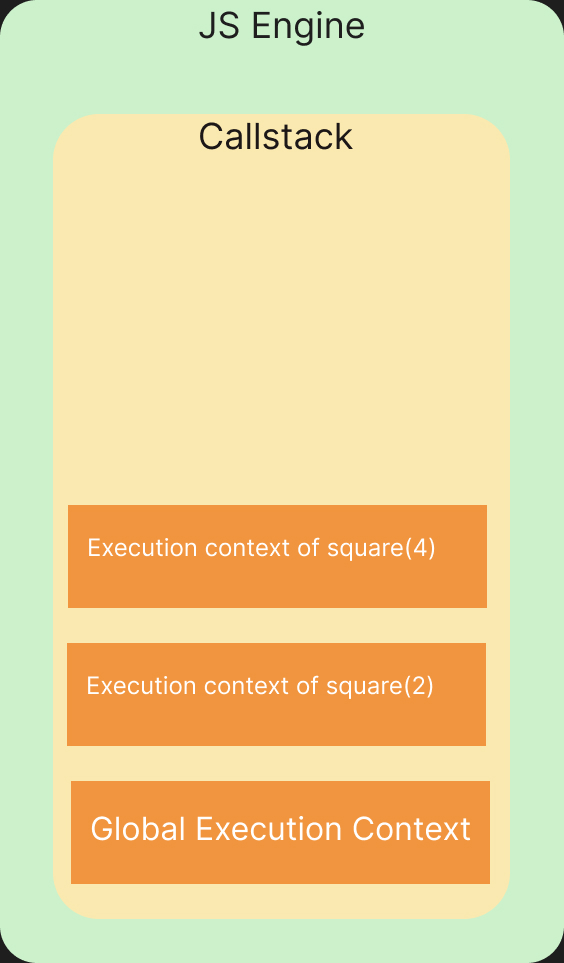
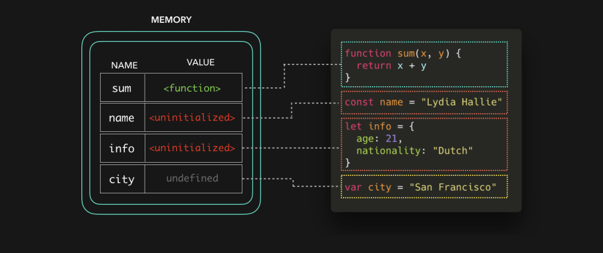
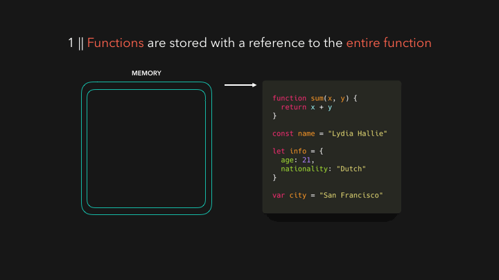
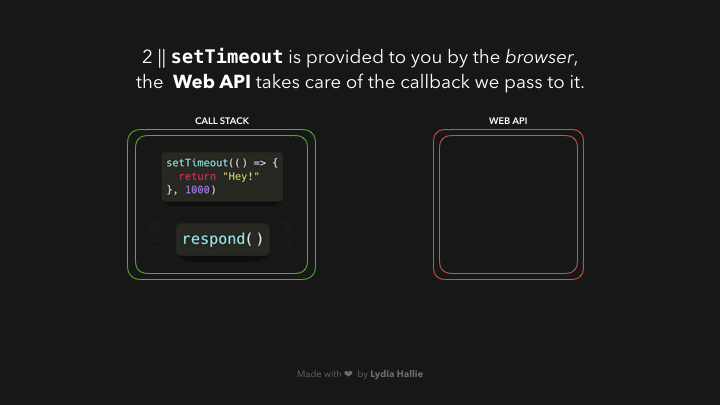
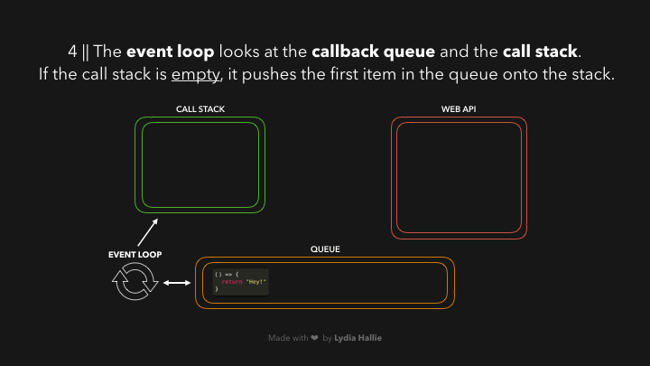
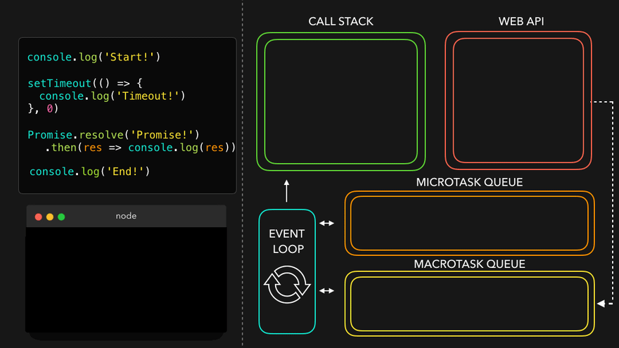
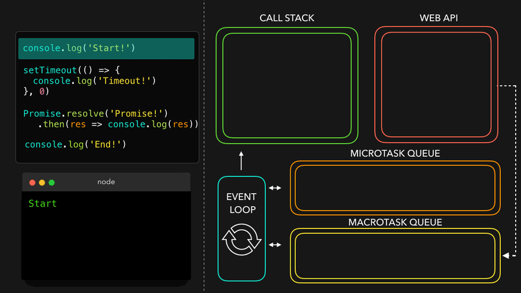
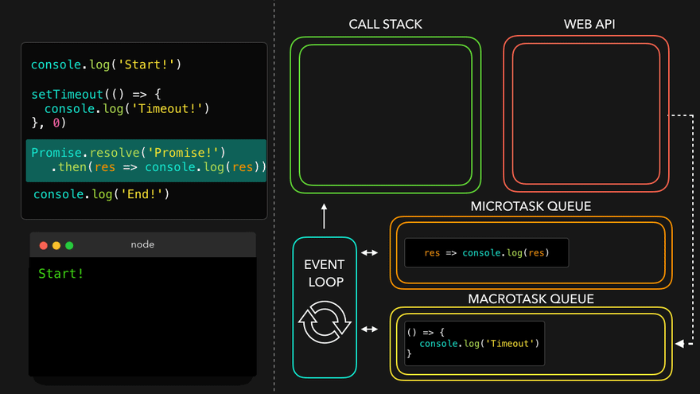
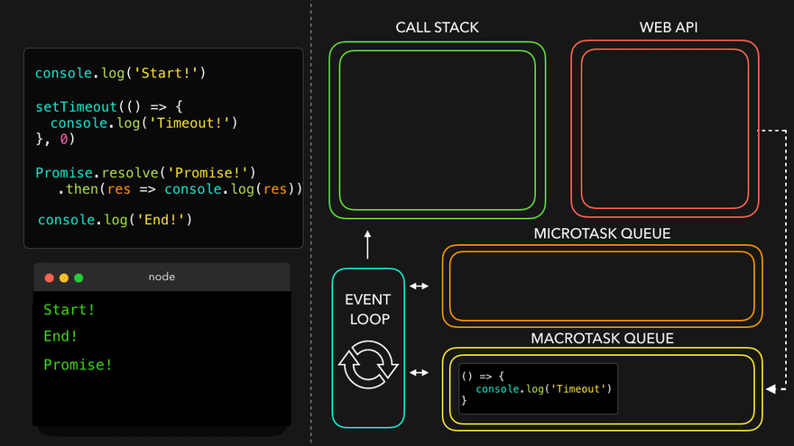

# Javascript

---

<details>
<summary>Index</summary>

### Index

- General
- variables  
- Scope
- JS Environment
- this Keyword
- Functions
- Operators
- Data Structures
- Asynchronous
- Datatypes
- String Methods
- Array Methods
- Object
- DOM
- Storage
- Class
- JSON
- Promise
- Object Methods
- Control Statements
- Template Literals

</details>

---

<details>
<summary>General</summary>


### General

##### What is **Javascript**?  
__JavaScript__ is a scripting language for web pages.  
we can also use Javascript on server-side as NodeJS.

we can create Dynamic Webpages by combinning HTML & Javascript.

##### Javascript Advantages
  - Server interaction is less.
  - Immediate response to the users.

##### Is JavaScript typed dynamically?
Yes, JavaScript is a dynamically typed language.

* We can declare a variable without specifying the data type.
* We can change the data type of the variable when it is reassigned

#####  Display Javascript Output

  ```Javascript
// console
console.log("Hello World");

// textContent
let myElement = document.getElementById("myElement");
myElement.textContent = "Hello World";

// innerHTML
let myElement = document.getElementById("myElement");
myElement.innerHTML = <h1>Hello World</h1>;

// write
document.write("Hello World");

// alert
window.alert("Hello World");

//prompt
window.promt("Hello World");
  ```

##### What is an ECMA Script?
__ECMA Script__ stands for __European Computer Manufacturers Association Script__.

It specifies the core features that a scripting language should provide and how those features should be implemented.

##### Javascript version
I know ES6 version

</details>

---

<details>
<summary>Variables</summary>

### Variable

Variables are like containers. we can use these containers to store data during program execution. we can mention a name for identify a particular container. So those named Containers are called variables. we can manipulate the data in the containers by reffering that variable name.

we can store different types of data in the containers. In programming languages, we have some categories in data.

Javascript supports various data types: 
1. number 
2. string
3. boolean
4. null
5. undefined

we can assign a value to the variable with the help of assignment Operator( = ).

##### __Define a Variable__
we can create variables using __Variable Declaration__ keywords .
In Javascript we can define a variable in 3 ways,

##### Declaration Keywords
1. var
2. let
3. const


##### Rules of Define a Variable

##### syntax

`Definition = Initialization`  
`declarationKeyword variableName = value;`


#### var
If a variable declare using `var`, then initialization is not mandatory. This variable can be re-assigned and re-declared.  
If a variable is declared inside a function, it is function-scoped. Else, it is global-scoped.

#### let 
If a variable is declared using let, then initialization is not mandatory. This variable can be re-assigned.  
we can't re-declare the same variable.

#### const 
If a variable is declared using const, then initialization is mandatory. Once the variable is initialized with a value, then it can't be re-assigned.  
const variable maintain constant values.

##### Differences between __var__, __let__ and __const__

| Declaration Keyword | Possible                                       | Not-Possible                  |
| ------------------- | ---------------------------------------------- | ----------------------------- |
| __var__                 | Initialization , Re-Assignment, Re-Declaration |                               |
| __let__                 | Initialization , Re-Assignment                 | Re-Declaration                |
| __const__               | Initialization                                 | Re-Assignment, Re-Declaration |

##### Memory Storage

Global Memory : __var__  
Block Memory : __let, const__

##### Types of Variables
1. Local Variable
2. Global Variable


##### Local Variable
If a variable is created inside a block, that type of variable is called Local Variable.  


*Example* :  
variable is created inside a function, When a function is called, its local variables are created, and when the function finishes it's executing, automatically those local variables are destroyed.  

Local variables are useful for temporary data storage within Block that should not interfere with other parts of the program. The Local Variable memory is created in the the Local Scope.
we can access these Local Variables only within that particular block of code.

##### Global Variable
If a variable is created outside of a block is called Global variable.
These Global Variables available upto end of the program execution.
These Global Variables can be accessed at any part of the code including Functions also.  
The Global Variable memory is created in the global scope.


##### Temporal Dead Zone
A block's __temporal dead zone__ starts at the beginning of the block's local scope. It ends when the computer fully initializes your variable with a value.  
From Hoisting to assigns some value to the variable is called temporal dead zone.  

we can't access the variables, when Variable in __TDZ__

```Javascript 
{
  // myVar TDZ starts here (at the beginning of this block's local scope)
  // myVar TDZ continues here
  // myVar TDZ continues here
  console.log(myVar); // returns ReferenceError because myVar continues here
  // myVar TDZ continues here
  // myVar TDZ continues here
  let myVar = "Vegetable Fried Rice"; // bestFood's TDZ ends here
  // myVar TDZ does not exist here
  // myVar TDZ does not exist here
}
```

#### Errors
Errors are 2 types:
1. syntaxError
2. Runtime Error

##### SyntaxError
 * Missing initializer in const declaration because it is a constant type already mentioned and declared.  
 * Identifier 'a' has already been declared.  
 * If we are not folloing rules of language, then we got syntax error.

##### Runtime Error
*  __ReferenceError__
   - When Javascript Engine tries to findout a specific variable inside the memory space but that variable does not exist in the memory space.
   - Cannot access 'a' before initialization .   
   - 'c' is not defined.  
   - If a variable in the __TDZ__, we cannot access that particular variable.

* __TypeError__ 
   * Assignment to constant variable.  
   * A Type error can be thrown when we try to make an operation on the incorrect data type.
  
</details>

---

<details>
<summary>Scope</summary>

### Scope
Memory storage location is called scope.  

we have 3 scopes in Javascript  
1. Global Scope (Global + Script)
2. Block Scope
3. Local Scope (Function Scope)

In Global Level with declaration keywords **let** and **const**, It maintain seperate memory with __script__ scope.  

##### what is Block ?
Block is used to combine multiple Javascript statements into one group.  

`Block is { }`

Block memory will be deleted after Execution completed.  
Each Block has it's own Lexical scope.

```javascript
// single statement, so we dont't use block.
if (true) console.log("Hello world");

// here we are using multiple statements, so we use block.
if (true){
    var a = 10;
    console.log(a);
}
```
##### Closure

A **Closure** is a combination of a __function__ and its __lexical scope__ bundle together forms a Closure.

A closure gives the outer function's scope access to an inner function that means it can be used the varaibles and functions of its parent environment.

`Closure => local Memory + Lexical Environment of Parent`

##### Lexical Environment
Its Parent Memory
##### Uses of Closures
* Timer Functions
* Events
* ...etc

##### Disadvantages of Closures
  * Over consumption of memory
  * Memory Leak
  * Freeze browser


##### Garbage Collector
Garbage collector is like program in the browser of the javascript engine.

In JavaScript, the garbage collector automatically __identifies__ and __removes__ unreferenced objects, freeing up memory to improve performance and prevent memory leaks in the application.

</details>

---

<details>
<summary>JS Environment</summary>

 ### Javascript Runtime Environment

 ##### Components
 1. Code
 2. JS Runtime Environment
 3. JS Engine
 4. Web APIs
 5. Microtask Queue
 6. Callback Queue
 7. Event Loop 

#### Code


#### JS Runtime Environment


#### JS Engine


#### Web APIs


##### Execution Context


In Javascript, Everything happens inside an __Execution context__ .
The Execution context is like a big container.
Inside the Execution Context entire JavaScript code is executed. 
Execution Contex contains two components.

`Execution Context => Memory Component + code Component`

`Execution Context => Creation Phase + Execution Phase`


##### Phases of Execution Context

1. Memory phase
2. Code Phase


##### __Memory Component__ (Variable Environment) 
In Memory Component all the variables and functions are stored as key-value pairs.
When the JavaScript engine allocates memory to a variable, it stores a special value `undefined` in it. In the case of functions, it stores the entire function inside the memory space.  
`pair = key : value`

##### __Code Component__ (Thread of Execution)

Code component is the place where code is executed one line at a time. It is also called the **Thread of Execution**.

In this phase, variables in memory component will be initialized.

JavScript is a **synchronous**, **single-threaded** language, which means that it can only execute one line of code at a time in a specific order. It can only move to the next line when the execution of the current line is completed.

single-threaded -> javascript only execute single line (one command) at a time.

synchronous -> Javascript execute next line when once current line execution is finished.

##### Callstack
Before execute the Javascript code, the Global Execution context will be created.  

The execution context is created in two phases : 
  * Memory creation phase - JS will allocate memory to variables and functions.
  * Code execution phase

callstack plays an important role in managing the execution of a program.

callstack handles, automatically create & delete operations of Execution Context.

When a function is invoked, a new execution context is added to the top of the call stack. Once the function execution is completed, its execution context is removed from the top of the call stack.

##### Hoisting
Hoisting is a javascript mechanism where __function declarations__ are moved to the top of their scope before code execution.

Hoisting is a JavaScript technique.

Before Execution of the JS code, It creates a Global Execution Context.

var keyword variables and function declarations are stored in Global Execution Context.

var keyword variable takes __undefined__ as a default value.

If it is a Function Declaraion, It will be stored entire function.

</details>

---

<details>
<summary>this Keyword</summary>

 ### __this__ keyword

##### Global space:
Any code write in javascript which is not inside a  function is called global space.

### window:
window object is created by javascript engine.
In window object we have lot of variables, methods and functions.
window object is a global object because it is created in the global space.
at the global level the window object is equal to __this__ object.

`window === this`

##### this
In JavaScript, __this__ keyword always refers to an object.  

* Function Declaration creates its own Execution Context So Function Declaration creates its own `this` object.  
  `Function Declaration : Where the function called.`

* Arrow Functions can't create its own Execution context, but it takes from Lexical environment. So Arrow Function, They inherit the __this__ object from their surrounding context.
  `Arrow Function : Where the Function Declared.`

In the global scope, this refers to the global object. 
`window === this`  


```Javascript 
// this

// this refers to the Object on which we call our function.

// This function declaration is stored in window object.
function displayName(){
    console.log(this.name, this);
}

const myObject = {
    name:"Ande Praveen",
    displayName:displayName
};

var name = "Brendan Eich";


myObject.displayName();  // Ande Praveen
window.displayName();  // Brendan Eich
```

```Javascript 

// this

// Arrow Function
// where was the Function defined.

const myObject1 = {
    sayHello:function(){
        var hello = function(){
            console.log("Hello", this);
        }
        hello();  //  the value of this is determined by how the function is called.
    }
};

const myObject2 = {
    sayBye:function(){
        var bye = () => {
            console.log("Bye", this);
        }
        bye()
    }
};

myObject1.sayHello();  // window
myObject2.sayBye();  // myObject2
```

##### this methods

we can manipulate the __this__ object with below methods.
* call
* apply 
* bind

###### call  
With __call__ we can invoke a method passing an owner object as an argument.

```Javascript 
// Define the first person object
const person1 = {
    name: 'Praveen',
    surname: 'Ande',
    
    // Define a method to concatenate the name and surname
    sayName: function() {
        return this.name + " " + this.surname;
    }
}

// Define the second person object
const person2 = {
    name: 'Brenden',
    surname: 'Eich'
}

// Call the sayName method of person1 with the context of person2 using .call()
const fullName = person1.sayName.call(person2);

// Output the result, which will be "Brenden Eich"
console.log(fullName);

```

</details>

---

<details>
<summary>Functions</summary>

##### Functions
Functions are heart ♥ of Javascript.

A JavaScript Function is a block of code designed to perform a particular task. A JavaScript function is executed when calls it.

We can define the code once, and use it many times. We can use the same code many times with different arguments, to produce different results (We can reuse code ).

#### Types of Functions

1. Function Declaration
2. Function Expression
3. Arrow Function
4. Anonymous Function
5. Named Function
6. Callback Function
7. First Class Function
8. Higher Order Functions

```javascript
// Function Declaration

function a() {
	console.log('Function Declaration');
}

a();

```

```javascript
// Function Expression

// function acts like a value.
let a = function () {
	console.log('Function Expression');
};
a();

```

```javascript

// Arrow Function

// function acts like a value.
let a = () => {
	console.log('Arrow Function');
};

a();
```


```Javascript
// Anonymous Function
// A function without a name is called Anonymous Function.

var a = function () {
	console.log('Anonymous Function');
};

a();

// These anonymous functions are used at where functions used as values.


```

```javascript
// Named Function

// A function with name is called Named Function
var a = function b() {
	console.log('Named Function');
};

a();

```

##### Difference between __Parameter__ and __Argument__

```javascript

// we create function with parameters
function a(parameter1, parameter2){
    console.log(parameter1, parameter2);
}

var argument1 = 10;
var argument2 = 20;

// we execute the function with arguments
a(argument1, argument2);
```

##### Callback Function
pass a function as a parameter is called callback function.

##### First class Functions
we can send functions as arguments, we can use function as a values..etc

##### Higher Order Functions
These Functions follows DRY Principle..  
__DRY__ Principle => Don't Repeat Yourself

##### Over Ridding
When we define the multiple functions with the same name, then the last defined one will be called. It is called Function Overriding.

JavaScript supports Function Overriding.

</details>

---

<details>
<summary>Operators</summary>

### Operators

1. Assignment
   * `=`
2. Arithmetic
   * `+ - * /`
3. Shorthand Math
   * `+=   -=  *=   /=`
4. Unary
   * `++   --`
5. Conditional 
   * `==   ===   !=   !===   <   >   <=   >=`
6. Logical
   * `&& || !`
7. Spread
   * `...` three dots
   * spread operator used to unpack the items in an Object or Array into individual elements.
8.  Rest
   * we can pack multiple values into an array.
9.  Ternary
    * `let variable = condition ? if-block : else-block;`


##### Loose Equal to ( == )
Loose equality compares two values for equality but doesn't compare type of values.

```Javascript
console.log(2 == "2"); // Output: true

```
##### Strict Equal to ( === )
Strict equality compares two values for equality including type of values.

```Javascript
console.log(2 === "2"); // Output: false
```

##### Spread Operator 
The Spread Operator is used to unpack an iterable (e.g. an array, object, etc.) into individual elements.

```Javascript
let arr1 = [2, 3];
let arr2 = [1, ...arr1, 4];

console.log(arr2);  // Output: [1, 2, 3, 4]
```

##### Rest Parameter
With Rest Parameter, we can pack multiple values into an array.

```Javascript
function numbers(...args) {
console.log(args);  // Output: [1, 2, 3]
}

numbers(1, 2, 3);
```
</details>

---

<details>
<summary>Data Structures</summary>

### Data Structures
Data Structure allow us to store and organize data efficiently.
This makes us access and performs operations on the data smoothly.  
In javascript, we have built-in Data structures like,
1. Arrays
2. Objects
3. Maps
4. Sets

</details>

---

<details>
<summary>Asynchronous</summary>

### Asynchronous  

Javascript cannot wait for anyone.

Some Javascript tasks may take time to complete, such as  
* fetch -> fetching data from External database,  
* timer -> perform tasks with timer
* Events -> responding to user input.

JavaScript doesn't wait for these Operations to finish and instead moves on to execute other code.

##### Queues
1. Callback Queue
2. Microtask Queue

##### Callback Queue
The purpose of the Callback Queue is to manage and execute functions (callbacks) in a specific order, typically after some asynchronous operation has completed.
- setInterval
- setTimeout
- Events

Timer Events takes callback function attach the timer and when the timer expires then push into the Callback Queue.

##### Microtask Queue
fetch always returns a Promise.  
A Promise is an object representing the eventual completion or failure of an asynchronous operation.  
we don't know how much of time take to __resolve__ or __reject__ the Promise. 
- fetch
- Promise Object


```javascript
// create Own Promise

function createOrder(){
    const ownPromise = new Promise((resolve, reject) => {
        if (true){
            const err = new Error("Cart in not valid");
            reject(err);
        }
        else{
            const orderId = "12345";
            resolve(orderId);
        }
    });

    return ownPromise;
}

const promise = createOrder()
console.log(promise);  // Promise

promise
.then((orderId) => console.log(orderId))
.catch((error) => {
    console.log(error.message);
});

```

##### Event Loop
Event Loop continuosly monitoring whether callstack is empty or not.  
if callstack is empty then checks the Microtask Queue & callback Queue. 
if there is any Microtask functions or callback functions , it automatically push it into the callstack delete from queue.  

Here Microtask Queue has more priority than the Callback Queue.

</details>

---

<details>
<summary>Datatypes</summary>

##### Datatypes

The `typeof()` operator is used to find the type of value.

1. __Primitive Datatypes__  
  Primitives are immutable.  Primitives are passed by value.
   - number
   - string
   - boolean
   - undefined
   - null
   

1. __Reference Datatypes__   
  References are mutable.  References are passed by reference.
   - Arrays
   - Objects
   - Maps
   - Sets
   - NaN

##### undefined
* If a variable is already declared, but value is not assigned to that variable, then it takes `undefined` as its value.
* variable is defined but It is using before Initialization.  
* The datatype of `undefined` is `undefined` itself.
* `undefined` is special keyword using for placeholder.
* Variable is already initialized but javascript in the memory phase assigned a default value __undefined__.

##### not defined
we didn't declare a variable.
so memory is not allocated for that particular variable.

##### null
null can be assigned to a variable as a representation of no value. 
It is used when we intentionally want a variable but don't need a value to it.   
The datatype of null is object. 

##### Data Structures
Data Structures allow us to store and organize data efficiently. This makes us access and performs operations on the data smoothly.

##### NaN
The NaN property represents __Not-a-Number__ value. The typeof of a NaN returns a Number.

```Javascript 
isNaN(345); // returns false
isNaN(undefined); // returns true
```

</details>

---

<details>

<summary>String Methods</summary>

#### String Manipulation Methods

* Conversion
  - `let output = myString.toUpperCase();`
  - `let output = myString.toLowerCase();`
  - `let output = myNumber.toString();`
* Checking
  -  `let output = myString.includes(part);`
  -  `let output = myString.startsWith(part);`
  -  `let output = myString.endsWith(part);`
* Cutting
  - `let listItems = myString.split(separator);`
  - `let slicedPart = myString.slice(startIndex, endIndex);`
  - `let subString = myString.substring(startIndex, endIndex);`
* Combinning
  - `combinedString = myString1.concat(myString2);`
* Updating 
  - `let trimmedString = myString.trim();`
  - `let output = myString.replace(searchValue, replaceValue);`
* Finding 
  - `let partStartIndex = myString.indexOf("part")`;

</details>

---

<details>
<summary>Array Methods</summary>

### Array Methods
An Array holds an ordered sequence of items. 

##### Normal Array Methods

* Finding
  - `let result = myArray.includes(item);`
  - `let result = myArray.indexOf(item);`
  - `let result = myArray.lastIndexOf(item);`
  - `let firstItem = Array.find(Testing Function);`
  - `let firstItemIndex = Array.findIndex(Testing Function);` 
  - `let arrayLength = myArray.length;` 
* Adding
  -  `myArray.push(lastItem);`
  -  `myArray.unshift(firstItem);`
  -  `myArray.splice(start, deleteCount, item1, item2...);`
* Removing
  - `let lastItem = myArray.pop();`
  - `let firstItem = myArray.shift();`
* Combining
  - `let newArray = myArray1.concat(myArray2);`
  - `let joinedString = myArray.join(separator);`
* Cutting
  - ` let arrayPart = myArray.slice(startIndex, endIndex);`
* Sorting
  - `myArray.sort();`


##### Higher Order Array Methods
These Methods are Iterate over each item of the Array and do some operations.

* __map__ 
  -  `let newArray = myArray.map(callback(currentValue, index, arr));`
  - Here index and arr are optional arguments.
 ```Javascript 
const myArray = [1, 2, 3, 4];
const output = myArray.map((eachItem) => eachItem * eachItem);
  console.log(output); // [ 1, 4, 9, 16 ] 
```

* __filter__
  -  `let newArray = myArray.filter(callback(currentValue, index, arr))`;
  - Here index and arr are optional arguments.
  
  ```Javascript 
  const myArray = [1,2,3,4,-5,-7,12];
  const filteredArray = myArray.filter((eachItem) =>   eachItem > 0);
  console.log(filteredArray); // [ 1, 2, 3, 4, 12 ]
  ```

* __reduce__
-  `let finalValue = myArray.reduce(callback(accumulator, currentValue, index, arr));`
  - Here accumulator is the initialValue or the previously returned value of the function and currentValue is the value of the current element, index and arr are optional arguments.
   
  ```Javascript 
     const myArray = [1,2,3,4];
     const output = myArray.reduce((accumulator,eachItem) =>  (accumulator + eachItem));
    console.log(output); // 10  
  ```

* __forEach__ 
  -  myArray.forEach(callback(currentValue, index, arr));
  - Here index and arr are optional arguments.
```Javascript 
const myArray = [1, 2, 3, 4];

let squaresList = [];
myArray.forEach((eachItem) => squaresList.push(eachItem * eachItem));

console.log(squaresList);  // [ 1, 4, 9, 16 ]
```

* __every__
* The every() method tests whether all elements in the array pass the test implemented by the provided function. It returns a Boolean value.
  -  `let finalBool = myArray.every(function(currentValue, index, arr));`
  - Here index and arr are optional arguments
```Javascript 
let myArray = [1, 2, 3, 4, 5];
const isAllPositive = myArray.every((eachItem) => eachItem > 0);
console.log(isAllPositive);  // true
```

* __some__
  - The some() method tests whether at least one element in the array passes the test implemented by the provided function.  
  - `let finalBool = myrray.some(function(currentValue, index, arr));`
  - Here index and arr are optional arguments.

```Javascript 
let myArray = [1, 2, 3, 4, 5, -6, -7, -8];
const isAnyOnePositive = myArray.some((eachItem) => eachItem > 0);
console.log(isAnyOnePositive);  // true
```

* __reverse__
  - The reverse() method reverses the order of the elements in an array. The first array element becomes the last, and the last array element becomes the first.
  - `let reversedArray = myArray.reverse();`

```Javascript
let myArray = [1, 2, 3, 4, 5];
console.log(myArray);  // [ 1, 2, 3, 4, 5 ]

let reversedArray = myArray.reverse();
console.log(reversedArray);  // [ 5, 4, 3, 2, 1 ]
```

* __flat__
- The flat() method creates a new array with all sub-array elements concatenated into it recursively up to the specified depth.
- `let newArray = myArray.flat(depth);`


```Javascript 
let myArray = [[1, [2, [[3, 4]], 5]]];
console.log(myArray);  // [[1, [2, [[3, 4]], 5]]]

let flatArray = myArray.flat(4);
console.log(flatArray);  // [ 1, 2, 3, 4, 5 ]
```

</details>

---

<details>
<summary>Object</summary>

### Object

##### Object Destructuring
we can make object key to a variable.  
To unpack properties from Objects, we use Object Destructuring. The variable name should match with the key of an object.  

```javascript
let person = {
  firstName: "Rahul",
  lastName: "Attuluri",
  age: 28,
};

let { age } = person;

console.log(age); // Output: 28
```

</details>

---

<details>
<summary>DOM</summary>

#### DOM 
Document Object Model (DOM) is the structured representation of the HTML document created by the browser.  
It allows Javascript to manipulate, structure and style of our website.

##### Real DOM
Real DOM is nothing but DOM. __DOM__ stands for __Document Object Model__. It is a structured representation of the HTML elements that are present in a webpage.
It represents the entire UI of your application.

##### Access HTML Element
* getElementsByClassName('classname'): Returns all the elements that have the specified class name. It returns an array-like object.

* getElementById('id'): Returns the element that has the specified id.

* getElementsByTagName('tagname'): Returns all the elements that have the specified tag name. It returns an array-like object.

* querySelector(): Takes CSS style selector as argument and returns the first selected HTML element.

```Javascript 
// Old Format
let element = document.getElementByTagName("div");  // <div>
let element = document.getElementById("test");  // <div id="test">
let element = document.getElementByClass("test");  // <div class="test"> 

// New Format
let element = document.querySelector("div");  //  <div>
let element = document.querySelector("#test"); // <div id="test">
let element = document.querySelector(".test");   // <div class="test">
let element = document.querySelectorAll(".test");   // <div class="test">
let childElement = document.querySelector('div .parent #child');
```

##### Javascript DOM properties
   * Value
     - textContent
   * CSS
     - style
   * Attribute
     - htmlFor, src, checked
     - `element.setAttribute(attribute, value);`
   * classList
   

##### DOM manipulation
DOM manipulation is interacting with the DOM to modify the HTML document that is to be rendered on the web browser.

javascript offers 3 ways to add an Event Listener to a DOM element.

1. Inline event Listener

```Javascript 
// inline event Listener => onclick attribute used in html

function greeting(){
    console.log("Inline Event Listener worked");
}
```
2. onevent listener

```Javascript 
// onevent

// onEvent Listener used in javascript with html element id.

let greetBtn = document.getElementById("greetBtn");

greetBtn.onclick = function(){
    console.log("onEvent Listener is working");
};
```
3. addEventListener

```Javascript 
// addEventListener()

/*
	It is a modern approach to add an event listener.
	element.addEventListener(event, function);
	element => HTML element
	event => event name
	function => callback function
*/

// htmlElement.addEventListener(eventName, callbackFunction);
let greetBtn = document.getElementById("greetBtn");

greetBtn.addEventListener("click", function(){
    console.log("addEventListener is working");
});
```

##### Events
  * Mouse Events 
     - mousedown, mouseup, click, dblclick, mousemove, mouseover, mousewheel, mouseout   
  * Keyboard Events
     - keydown, keypress, keyup  
  * Form Events 
     - focus, blur, change, submit  
  * window Events 
     - scroll, resize, load, unload  

  ##### preventDefault()
```Javascript
// Here in the form, it prevents the default behaviour of the submit event.
    event.preventDefault();
```
 
##### Element Manipulation
```Javascript 
/// DOM Manipulations

// Element selection through id
let myContainer = document.getElementById("myContainer");

// creating an HTML element
let headingElement = document.createElement('h1');
headingElement.textContent = "Hello World";
console.log(headingElement);

// adding an Element at End.
// Appending to Existing myContainer Element
myContainer.appendChild(headingElement);

// Removing the Element
myContainer.removeChild(headingElement);

```

</details>

---

<details>
<summary>Storage</summary>

### Storage
Storage Mechanism:
1. client-side Data storage:
client-side Data storage is storing the data on the client (user's machine).

1. Local Storage
2. Session Storage
3. Cookies
4. IndexedDB and many more.

2. server-side Data storage:
Server-side Data Storage is storing the data on the server.

##### localStorage
- The Local Storage allows web applications to store data locally within the user's browser. It is a Storage Object. Data can be stored in the form of key-value pairs.
- Local storage data never expires
- Local Storage can store up to 5 to 10 MB of data

`localStorage.setItem("Key", "Value");`  
`localStorage.getItem("Key");`  
`localStorage.removeItem("Key");`  
`localStorage.clear();`


##### Cookies
- `js-cookie` is the third-party package
- We can set an expiration for Cookies
- Cookies can store up to 4KB of data
- we can get undefined, when cookies is expired
 
```Javascript 
const token = Cookies.get("jwt_token"); // Assume that there is was a Cookie set with the key "jwt_token" with value the 1234
 
if (token === undefined) {
 console.log("Cookie is expired");
}
```

</details>

---

<details>
<summary>class</summary>

### class

##### Inheritance
Inheritance is a mechanism by which a class inherits methods and properties from another class.

```Javascript 
class SuperClass {
  constructor(property1) {
    this.property1 = property1;
  }
  method1() {}
}
class SubClass extends SuperClass {
  constructor(property1, property2) {
    super(property1);
    this.property2 = property2;
  }
  method1() {}
}
let myObject = new SubClass(argument1, argument2);
```

Here, SubClass inherits methods and properties from a SuperClass.

* The extends keyword is used to inherit the methods and properties of the superclass.

* Calling super() makes sure that SuperClass constructor() gets called and initializes the instance.

##### What is the Static keyword in JavaScript?
The static Keyword defines a static method or property for a class.

Static methods or Static properties cannot be called on instances of the class. They are called on the class itself.

```Javascript 
class Rectangle {
  constructor(height, width) {
    this.height = height;
    this.width = width;
  }

  static displayName = "Rectangle";
  static print() {
    return "Static method print() is called from Rectangle";
  }
}

console.log(Rectangle.displayName); // Output: Rectangle
console.log(Rectangle.print()); // Output: Static method print() is called from Rectangle

let rectangle1 = new Rectangle(10, 8);

console.log(rectangle1.displayName); // Output: undefined
console.log(rectangle1.print()); // TypeError: rectangle1.print is not a function
```

From the above example,

* Calling a Static property from a class instance will return undefined
* Calling a Static method from a class instance will throw an error


</details>

---

<details>
<summary>JSON</summary>

### JSON

**JSON** stands for **JavaScript Object Notation**.

It is a data representation format used for:

* Storing data (Client/Server)
* Exchanging data between Client and Server

JSON Methods
* stringify
* parse

```javascript
let profile = {
  name: "Rahul",
  age: 29,
  designation: "Web Developer"
};
```

```JSON
{
  "name": "Rahul",
  "age": 29,
  "designation": "Web Developer"
}
```
</details>

---

<details>
<summary>Promise</summary>

### Promise
Promise Methods
* The then method is called after the Promise is resolved.
* The catch method is called after the Promise is rejected.

 A Promise will be in any one of the three states

1. Pending : Neither fulfilled nor rejected.
2. Fulfilled : Operation completed successfully.
3. Rejected : Operation failed.

### Async and Await
The async/await simply gives you a synchronous feel to asynchronous code.   
The await keyword in JavaScript is used within an async function to pause the execution of that function until a promise is resolved. 

```Javascript 

// Asynchronous Execution

const myFunction = async () => {
    const url = "https://apis.ccbp.in/jokes/random";
    const response = await fetch(url);
    const data = await response.json(); // Use await here
    console.log(data);
}

// Call the async function
myFunction();

// Statement 2
console.log("fetching done");

```

```Javascript 

// Asynchronous Execution

const url = "https://apis.ccbp.in/jokes/random";

fetch(url)
    .then((response) => {
        return response.json();
    })
    .then((jsonData) => {
        // statement 1
        console.log(jsonData)
    });


// statement 2
console.log("fetching done");


// The second statement won't wait until the first statement execution.
// In JS fetch() works asynchronously.
```
</details>

---
<details>
<summary>Object Methods</summary>

### Object Methods 

* Object.keys():

Object.keys() is a built-in JavaScript method that returns an array of a given object's property names. The array order reflects the sequence in which properties were defined in the object.


* Object.values():

Object.values() returns an array of a given object's property values, providing the values in the same sequence as properties were defined.

```Javascript 
let jsonObject = {
    "name": "John",
    "age": 25,
    "city": "New York"
};

let keys = Object.keys(jsonObject);   
let values = Object.values(jsonObject); 

console.log(keys);   // Outputs: ["name", "age", "city"]
console.log(values); // Outputs: ["John", 25, "New York"]
```
</details>

---

<details>
<summary>Control Statements</summary>

### Control Statements
#####  Conditional Statements
The conditional statement allows you to execute a block of code only when a specific condition true.

```javascript
let age = 30;

if (age > 30){
    console.log("Yes, His age is above 30 years");
}
else if(age === 30){
    console.log("His age is exactly 30 years");  // His age is exactly 30 years
}
else{
    console.log("Yes, His age is below 30 years");
}

```

##### Looping Stataments
Loops allow us to execute a block of code several times.

###### for loop
1. for-of
   - It gives values
2. for-in  
   - It gives Indexes of values
3. for loop


###### while loop
1. while loop
2. do-while loop


##### Jumping Statements

```Javascript 
let day = 4;

switch (day){
    case 0:
        console.log("Sunday");
        break;

    case 1:
        console.log("Monday");
        break;
    case 2:
        console.log("Tuesday");
        break;
    case 3:
        console.log("Wednesday");
        break;
    case 4:
        console.log("Thursday");  // Thursday
        break;
    case 5:
        console.log("Friday"); 
        break;
    case 6:
        console.log("Saturday");  
        break;
    default:
        console.log("Invalid"); 
}
```

</details>

---

<details>
<summary>Template Literals</summary>

### Template Literals (Template Strings)
  * The Template Literals are enclosed by the backticks. => ` `
  * we can include the variable or expressions using a dollar sign with curly braces. => ${}

```Javascript 
let myName = "Ande Praveen";
let output = `Hello ${myName}`;
console.log(output);  // Hello Ande Praveen
```
</details>

---

<details>
<summary>Code Working</summary>

### Code Working

##### Hoisting




##### Event Loop







##### Microtask Queue







</details>

---