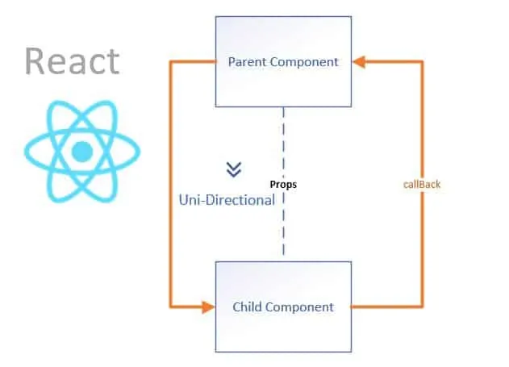

# React JS

<details>
<summary>Index</summary>

### Index

* Introduction
* create App
* Component Life Cycle
* DOM
* Unidirection
* Component
* Class Component
* Functional Component
* React Events
* state
* props
* Routing
* React Context
* React Hooks
* Redux
* Component Styles
* General
* API
* Authentication
* Tricky Questions
* Third Party Packages
* Debugging
* Important Concepts
</details>

---

<details>
<summary>Introduction</summary>

### Introduction

##### React JS
__React JS__ is an open-source JavaScript library. It was developed by Facebook.  
   * ReactJS is used to building user interfaces.  
   * we can create __Single Page Applications (SPA)__ by using ReactJS .
   * React allows us to create __reusable components__. 

 ##### Advantages of ReactJS
 * Open Source
 * Easy to Learn
 * Large Community
 * Reusability of components
 * Virtual DOM


  ##### React Version
  react@17.0.0

  ##### React Components
  In __React JS__, there are 2 components
  * Class Component
  * Functional Component

##### React with CDN Links

###### React Element
`React.createElement()` 

* `React.createElement()` method used to create an element using React JS.
* It is similar to the `document.createElement()` method in regular Javascript.
`React.createElement(type, props);`
   - type => tag names => h1, div
   - props => properties => className, onClick, id 

##### Render
`ReactDOM.render()`

* `ReactDOM.render()` method is used to display the React element

`ReactDOM.render(reactElement, container);`

   - reactElement => What to render 
   - container => where to render
```HTML 
 <!--React JS CDN Files-->
    <script crossorigin src="https://unpkg.com/react@18/umd/react.development.js"></script>
    <script crossorigin src="https://unpkg.com/react-dom@18/umd/react-dom.development.js"></script>
```
```HTML 
<script type="module">

    // what to render
    const elementType = "h1";
    const elementProps = {className:"greeting", children:"Hello World"};
    const element = React.createElement(elementType, elementProps);

    // where to render
    const rootElement = document.getElementById("root");

    // ReactDOM.render(what, where);
    ReactDOM.render(element, rootElement);

</script>
```
</details> 

---

<details>
<summary>Create App</summary>

### Create App

##### npx 
Creating a real-world app involves lot of setup because a large number of components need to be organised.  
`npx create-react-app my-app` to generate a ready-made React application setup.

```BASH
npx create-react-app my-app
cd my-app
npm start
```
</details>

---

<details>
<summary>Component Life Cycle</summary>

### Component Life Cycle
It is a different stages of the Component during its existence.
* Mounting
* Updating
* Unmounting

##### Mounting
In the Mounting phase, the instance of a component is created and inserted into the DOM.

##### Updating
In Updating phase, the component is updated whenever there is a change in the component's state. 

##### Unmounting
In Unmounting phase, the component instance is removed from the DOM. 

</details>

---

<details>
<summary>DOM</summary>

### DOM
__DOM__ stands for __Document Object Model__ .  
* The DOM is __UI__ of your application.
* It is the structured representation of the HTML document created by the browser. 
* It allows JavaScript to manipulate, structure, and style your website.


##### Types Of DOMs
  * Real DOM
  * Virtual DOM

##### ReactDOM
__ReactDOM__ is the JavaScript library that allows React to interact with the Real DOM.

```Javascript 
import React from 'react'
import ReactDOM from 'react-dom'
import App from './App'

ReactDOM.render(
  <React.StrictMode>
    <App />
  </React.StrictMode>,
  document.getElementById('root'),
)
```

##### Real DOM
__HTML DOM__ is called __Real DOM__.

##### Virtual DOM
* DOM is created by React JS is called Virtual DOM.
* The virtual DOM is only a virtual representation of the DOM.
* when any changes are made on __UI__ then new Virtual DOM is created.
* React compares new virtual DOM with current virtual DOM, and the difference will be updated to the Real DOM.

</details>

---

<details>
<summary>Unidirectional</summary>

### Unidirectional
* The data flow of React is a Unidirectional data flow.

* Unidirectional data flow means a one-way data flow where the data has only one way to be passed to all the child components.

It means only one component can maintain and update the state. The state is passed to the child components through props.

When we want to update the state by the event triggered in the child component, we can't directly change the props in child components as props are read-only.

Thus, the state only gets updated in the parent component as props are read-only. The state is passed to all the child components through the props.

Some of the advantages of Unidirectional data flow are:

* we have more control over the data
* Easier to debug as we know what data is coming from where



</details>

---

<details>
<summary>Component</summary>

### Component
A Component is a JS function that returns a JSX element.

```Javascript 
const Welcome = () => <h1 className="message">Hello, User</h1>;
```

* If function name starts with Capital letter then only react treats as Component otherwise react treats as HTML Element.
* We can call the function ( Component )with self-closing tags `<Welcome />`.

##### Types of Components in __React JS__

1. Class Component
2. Functional Component


</details>

---
<details>
<summary>Class Component</summary>

### Class Component
* If function name starts with Capital letter then only react treats as Component otherwise react treats as HTML Element.
* The component name should always be in the pascal case.
* Class Component we can call as stateful Component.
 * A class component requires you to extend from React Component and create a render method that returns a JSX element.
```Javascript
import { Component } from "react";

class App extends Component {

  // Updating
  render() {

    // Return JSX
    return <div>App Component</div>;
  }
}
```

##### __extends__ keyword
The `extends` keyword is used to inherit methods and properties from the `React.Component`.

##### class Component Life Cycle Methods
* Mounting Phase
  - constructor()
  - render()
  - componentDidMount ()
* Updating Phase
  - render()
* Unmounting Phase
  - componentWillUnmount()


##### Mounting Phase
In this phase, the instance of a component is created and inserted into the DOM.
1. __constructor()__
   - The `constructor()` method is used to setup the initial state and initialize the instance of properties.
  
```Javascript 
 constructor(){
super(props);
this.state = {key:"value"}
}
```
2. __render()__
   - `render()` method is used to return the JSX that is displayed in the UI.
   - If more than one HTML element is to be rendered, then they must be grouped using a container element or react fragment.
   - `render()` is called whenever the state is updated using `setState` method.

3. __componentDidMount()__
The componentDidMount method is used to do operations on the components after the initial render that means the component already placed in the DOM.  
In General we make API Calls inside componentDidMount() so that it doesn't block render().
__Example__: Setting timers, initiating API calls, ...etc.


##### Updating Phase
In this phase, the component is updated whenever there is a change in the component's state.
1. __render()__
  - The `render()` is called whenever there is a change in the component's state.
  
##### Unmounting Phase
In this phase, the component instance is removed from the DOM.
1. __componentWillUnmount()__
 - The `componentWillUnmount()` is invoked immediately before a component is unmounted and destroyed. All the cleanup activities are performed in this method. 
 - __Examples__: Canceling network requests, cleaning up any subscriptions, etc.

</details>

---

<details>
<summary>Functional Component</summary>

### Functional Component
  * A functional component is just a JavaScript function that accepts props as an argument and returns a React element.
  * There is no render method used in functional components.
  * If component have don't have any state, then It is called Stateless component.
  * React lifecycle methods `(constructor, componentDidMount, componentWillUnmount, render ...etc.)` cannot be used in functional component.

```Javascript 
const App = () => {
  return (
    <div>App Component</div>
  )
}
```
</details>

---

<details>
<summary>React Events</summary>

### React Events
Handling events with React elements is very similar to handling events on DOM elements.  
There are some syntax differences:
1. React events are named using camelCase, rather than lowercase.

|   HTML   |      JSX |
| :------: | -------: |
| onclick  |  onClick |
|  onblur  |   onBlur |
| onchange | onChange |


```Javascript 
/* -----> Third Party Packages <----- */
import {Component} from 'react' // Component is for creating class Components

/* -----> Creating Components <----- */

// class Component
class App extends Component{
   
    // Methods
    onButtonClick = () => {
        console.log("clicked")
    }

    // Updating
    render(){

        // Return JSX
        return (
            <div className="card-component">
                <p>Click on Button and see on console</p>
                <button onClick={this.onButtonClick} type="button">Button</button>
            </div>
        )
    }
}

/* -----> Default Export <----- */
export default App;

```

</details>

---

<details>
<summary>state</summary>

### state
* State is created and managed within the component, similar to a variable declared within the function.
* State is used to store the component's data that changes over time.
* We can update state 
  - `setState` method
  - `useState` hook
* when the state changes, automatically the component re-renders.
* If we try to update the state directly then it won't re-render the component.
* state should be immutable

##### setState
The state is a JS object in which we store the component's data that changes over time.
When the state object changes, the component re-renders.

```Javascript 
// Initialization
  constructor(props){
        super(props)
        this.state = {count:0}  // When the state object changes, the component re-renders.
    }

// Methods
    onIncrement = () => {
        // updating state
        this.setState((prevState) => ({count:prevState.count+1}))  // Function as an argument
    }

    onReset = () => {
		// updating state
        this.setState( {count:0})  // Object as an argument
    }
```

##### setState() callback function
The `setState()` method is a asynchronous, it takes an optional callback parameter that can be used to make updates after the state is changed.

```Javascript  
this.setState({key1:value1}, callback)
```
</details>

---

<details>
<summary>props</summary>

### props
* Props stands for Properties.
* We can pass information from __Parent Component__ to __Children Component__ by using props.
* we can pass information throung attributes.
* The children component accept props as parameters and can be accessed directly.
*  Child Component can't change the props.
*  * props are immutable. A component cannot change the props.


##### Parent Component
```Javascript 
// Import External Componenta
import Child from './components/Child'

const App = () => (
  <Child greeting="Hello" name="Praveen Ande"/>
)

// Default Export 
export default App;

```

##### Child Component
```Javascript 
const Child = (props) => {
// props object Destructuring
const {greeting, name} = props;

// Retur JSX 
return (
<div>
 {greeting} {name}
</div>
);
};

// Default Export
export default Child;
```


##### Reusability of Component
A Component is a piece of code that can be used in various parts of an application.

##### Parent Component
```Javascript 
// Import External Componenta
import Child from './components/Child'

const App = () => (
<div>
    <Child greeting="Hello" name="Praveen Ande"/>
     <Child greeting="Hello" name="Brenden Eich"/>
</div>
 
)

// Default Export 
export default App;

```

##### Composable Component
We can include a component inside another component.

##### Child Component
```Javascript 
const Child = (props) => {
// props object Destructuring
const {greeting, name} = props;

// Retur JSX 
return (
<div>
 {greeting} {name}
</div>
);
};

// Default Export
export default Child;
```


##### key prop in list items
Keys help React identify which items have changed, are added or are removed. Keys should be given to the elements inside the array to give the elements a stable identity.

##### children prop
Children is a prop  that allow you to pass components as data to other components. Component tree put between component's opening and closing tag will be passed to that component as children prop.  
The best way to pick a key is to use a string that uniquely identifies a list item among its siblings.
Most often, we would use IDs (uniqueNo) from our data as keys.

```Javascript 
const Message = (props) => {
const first = props.children[0]
const last = props.children[1]
return (
   <div>
      {first}
      {last}
  </div>
);

}

export default Message
```

```Javascript 
import Message from './components/Message';

const App = () => (
  <Message>
    <span>Hello</span>
    <span>World</span>
</Message>
)

export default Message
```


##### Prop Drilling
Prop Drilling is a process in which Props are passed from one Component to another Component that does not need the data but only helps in passing it through the tree.


##### Default Properties
When a component is rendered through the __route__, some of the additional props are passed.

They are:
* __match__: The match object contains the information about the path from which the component is rendered.
* __history__: The history object has some methods to control the navigation in the browser. It also maintains the history of the routes we navigated. Some of the methods to control the navigation are history.push, history.replace, etc.
* __location__: The location object contains the information about the current URL.


##### defaultProps
defaultProps is a property in React Component used to set default values for the props.
This is similar to adding default parameters to the function.

```Javascript 

/* -----> import styles <----- */
import './index.css'  // CSS File

/* -----> Creating Components <----- */

// Functional Component
const Welcome = (props) => {
    console.log("Welcome Component")
    const {greeting, name} = props

    // return JSX
    return(
        <div className="welcome-component">
            <h1 className="message">
                {greeting}, {name}
            </h1>
        </div>

    )
}

/* -----> Default Props <----- */
Welcome.defaultProps = {
    name: "Rahul",
    greeting: "Hi"
};


/* -----> Default Export <----- */
export default Welcome;

```
</details>

---

<details>
<summary>Routing</summary>

### Routing
* Routing in __React JS__ is a mechanism that allows you to navigate and display different views or components in a single-page web application.

* 
It enables users to move between different parts of the application without the need of a full page reload. `react-router-dom` is a popular library used for implementing routing in React applications.

* In React, we build single-page applications using __React Router__.

* To implement routing, React Router provides various components.
   - BrowserRouter
   - Link
   - Route
   - Switch


##### BrowserRouter
 To add routing wrapping all the components with BrowserRouter.
##### Switch 
 The Switch Component will only render's the first route that matches the path. If no path matches, it renders the NotFound component.

 ##### Route
 * The Route Component renders specific UI component when path matches current URL. 
 * exact keyword renders the route if path matches exactly the current url.

##### Link
The Link Component creates hyperlinks that allows to navigate around in application.
The to prop specifies absolute path.

##### Redirect
Redirect Component is used to redirect to another path

##### withRouter 
To provide history prop to other components, we can wrap it with the withRouter function while exporting it.
`export default withRouter(Header)`


```Javascript 
// ----->> src/components/Header/index.js <<-----
import { Link } from "react-router-dom";

const Header = () => {
  return (
    <nav>
      <ul>
        <li>
          <Link to="/">Home</Link>
        </li>
        <li>
          <Link to="/greeting">Greeting</Link>
        </li>
      </ul>
    </nav>
  );
};

export default Header;
```

```Javascript 
// ---------------------------->> src/App.js <<-----------------------------------
import { BrowserRouter, Route, Switch } from "react-router-dom";

import { Home } from "./components/Home";
import Header from "./components/Header";

const Greeting = () => <h1>Welcome to React Routing</h1>;

const NotFound = () => <h1>Not Found</h1>;

const Home = () => <h1>Home Route</h1>;

const App = () => {
  return (
    <BrowserRouter>
      <Header />
      <Switch>
        <Route exact path="/" component={Home} />
        <Route path="/greeting" component={Greeting} />
        <Route component={NotFound} />
      </Switch>
    </BrowserRouter>
  );
};

export default App;
```


##### Route Props
when a component is rendered by the Route, some additional props are passed.
* match
* location
* history


##### Wrapper Component
 Redirection Logic can be reused by separating out into a React Component called Wrapper Component. Each route will be wrapped with it.
```Javascript  

/* -----> Third Party Packages <----- */
import { Route, Redirect } from "react-router-dom";  // // routing Components
import Cookies from 'js-cookie'  // Cookies is used to store data on client-side with expiry duration.

/* -----> Creating Components <----- */

// Functional Component

// ProtectedRoute is the Wrapper Component
const ProtectedRoute = (props) => {
    console.log("protectedRoute Wrapper Component")
    console.log(props)
    const token = Cookies.get("jwt_token");
    if (token === undefined) {
        return <Redirect to="/login" />;
    }
    return <Route {...props} />;
};

/* -----> Default Export <----- */
export default ProtectedRoute;
```
</details>

---

<details>
<summary>React Context</summary>

### React Context
React Context is a mechanism to avoid prop drilling.

Prop Drilling means passing data from one Component to another Component that does not need the data but only helps in passing it through the tree.


```Javascript
import { createContext } from 'react';

const MyContext = createContext({
	name: '',
	onUpdateName: () => {},
});

export default MyContext;
```

```Javascript 
import React from 'react';
import { useState } from 'react';

import Child from './components/Child';
import MyContext from './context/MyContext';

const App = () => {

	const [name, setName] = useState('Ande Praveen');

	const onUpdateName = (updatedName) => {
		setName(updatedName);
	};

	// React ContextObject
	const valueObject = {
		name,
		onUpdateName,
	};

	// Return JSX
	return (
		<div>
			<MyContext.Provider value={valueObject}>
				<Child />
			</MyContext.Provider>
		</div>
	);
};

export default App;

```

we can access React Context Object with `useContext()` hook.

```Javascript 
import React from 'react';
import { useContext } from 'react';

import MyContext from '../../context/MyContext.js';

const Child = () => {

	const { name } = useContext(MyContext);
	console.log(name);
	// Return JSX
	return <div>Child</div>;
};

export default Child;

```


</details>

---

<details>
<summary>React Hooks</summary>

### React Hooks
React Hooks helps to lifecycle methods, context and other react features in the Functional Component.

  * State Hooks
     - useState 
     - useReducer 
  * After Component Mounting
     - useEffect 
  * React Context
     - useContext 
  * Memory    
     - useMemo
     - useCallback
  * Reference    
     - useReference 
  * Own Hooks
     - useCustomHook


##### React Hooks Advantages
* Components become simple and easy to understand
* less lines of code
* No need of switching between class & Function Components
* Developers and Companies are gradually adapting to React Hooks


##### State Hooks

#####  __useState()__ 
we can use state in Function Component with the help of `useState()`. 
```Javascript 
   const [currentState, setterFunction] = useState(initialValue);
```

```Javascript 
// value => Independent
setterFunction(nextValue);

// callback => Dependent
setterFunction((prevState) => nextState);
```

```Javascript 

/* -----> Third Party Packages <----- */
import {useState} from 'react'

/* -----> Creating Components <----- */

// Functional Component
const Card = () => {
    // State Initialization
     const [isLogin, setIsLogin] = useState(false)

    // Methods
    const onButtonClick = () => {
        setIsLogin((prevState) => !prevState)
    }

    const buttonText = isLogin ? "Logout" : "Login"
	
	// Return JSX
    return (
        <div className="card-component">
            <div className="card-container">
                <button type="button" className="button" onClick={onButtonClick}>{buttonText}</button>
            </div>
        </div>
    )
}

/* -----> Default Export <----- */
export default Card

```

##### __useReducer()__
Add state to Function Component. Handling complex state.
```Javascript 
const [currentState, dispatch] = useReducer(reducerFunction, initialState)
```

```Javascript 
import{ useReducer } from 'react';

const App = () => {

	// Methods
	const counterReducer = (prevState, action) => {
		const { type, payload } = action;
		console.log(type, payload);
		let newState;
		if (type === 'increment') {
			newState = prevState + payload;
		} else {
			newState = prevState;
		}
		return newState;
	};

	// Initialization
	const [counter, dispatchCounter] = useReducer(counterReducer, 0);

	// Return JSX
	return (
		<div >
			<p className="m-2">counter : {counter}</p>
			<button
				onClick={() =>
					dispatchCounter({ type: 'increment', payload: 1 })
				}
				type="button"
				className="btn btn-info"
			>
				+
			</button>
		</div>
	);
};

export default App;

```

##### After Component Render Hooks

##### __useEffect()__
Execute the Logic after the Component render.
Example : Making API calls, Timer Functions, ...etc

`useEffect(callback, dependencyArray)`

```Javascript  
import {useState, useEffect} from 'react'

const Clock = () => {
  const [date, setDate] = useState(new Date())

  useEffect(() => {
    const timerId = setInterval(() => {
      setDate(new Date())
    }, 1000)
    
    // Return will Execute before component Unmount
    return () => clearInterval(timerId)
  }, [])

  return (
      <p>{date.toLocaleTimeString()}</p>
  )
}

export default Clock

```

##### React Context Hook
##### __useContext()__
we can access React Context Object with `useContext()` hook.

```Javascript
import { createContext } from 'react';

const MyContext = createContext({
	name: '',
	onUpdateName: () => {},
});

export default MyContext;
```

```Javascript 
import React from 'react';
import { useState } from 'react';

import Child from './components/Child';
import MyContext from './context/MyContext';

const App = () => {

	const [name, setName] = useState('Ande Praveen');

	const onUpdateName = (updatedName) => {
		setName(updatedName);
	};

	// React ContextObject
	const valueObject = {
		name,
		onUpdateName,
	};

	// Return JSX
	return (
		<div>
			<MyContext.Provider value={valueObject}>
				<Child />
			</MyContext.Provider>
		</div>
	);
};

export default App;

```

```Javascript 
import React from 'react';
import { useContext } from 'react';

import MyContext from '../../context/MyContext.js';

const Child = () => {

	const { name } = useContext(MyContext);
	console.log(name);
	// Return JSX
	return <div>Child</div>;
};

export default Child;

```


##### Memory Hooks
##### __useMemo()__
`let value = useMemo(callback, dependencyArray)`

when re-render,  the function only will call when dependency array values changes.
stop the function call when same arguments of re-render.

```Javascript 
import React from 'react';
import { useMemo, useState } from 'react';

const App = () => {
	console.log('App Component');

	const [isDone, setIsDone] = useState(true);

	let a = 10;
	let b = 20;

	// Methods
	const sum = (num1, num2) => {
		console.log('sum Method');
		return num1 + num2;
	};

	let result = useMemo(() => {
		console.log('useMemo Call');
		const add1 = sum(a, b);
		return add1;
	}, [a, b]);

	console.log(result);

	// Return JSX
	return (
		<div>
			<button
				type="button"
				onClick={() => {
					setIsDone(!isDone);
				}}
			>
				Update State
			</button>
		</div>
	);
};

export default App;

```

##### __useCallback()__
* useMemo(fn, []) => It executes fn() and returns the value when [] changes.
* useCallback(fn, []) => It returns fn when [] changes


```Javascript 
import React, { useState, useCallback } from 'react';

function App() {
  const [count, setCount] = useState(0);

  // Without useCallback
  const increment = () => {
    setCount(count + 1);
  };

  // With useCallback
  const decrement = useCallback(() => {
    setCount(count - 1);
  }, [count]);

  return (
    <div>
      <p>Count: {count}</p>
      <button onClick={increment}>Increment</button>
      <button onClick={decrement}>Decrement</button>
    </div>
  );
}

export default App;

```


##### Custom Hook
we can create own hooks.
we should mention `use` word before custom hook for identify a custom hook.

```Javascript 
// Utilities
// Custom Hooks

import { useEffect, useState } from 'react';

export const useGetAPIData = (apiUrl) => {
	console.log('useGetAPIData Custom Hook');
	// Initialization
	const [data, setData] = useState([]);

	// Mounting
	useEffect(() => {
		getData();
	}, []);

	// Methods
	const getData = async () => {
		const options = {
			method: 'GET',
		};

		const response = await fetch(apiUrl, options);
		const data = await response.json();
		console.log(data);
		setData(data);
	};

	// Return Data
	return data;
};

```

```Javascript 
import React from 'react';
import { useGetAPIData } from './utilities'; // Custom Hooks

const App = () => {
	console.log('App Component');

	const apiUrl = 'https://fakestoreapi.com/products/1';
	const data = useGetAPIData(apiUrl);
	console.log(data);

	// Return JSX
	return <div>Custom Hook</div>;
};

export default App;

```

##### Reference Hooks
##### __useRef()__

Certainly, here's a small example of how you can use useRef to persist a value across renders without causing re-renders.

```Javascript 
import { useRef } from 'react';

import './App.css';

const App = () => {
	console.log('App Component');

	let headingElement = useRef(null);
	console.log(headingElement);

	// Return JSX
	return (
		<div>
			<h1 ref={headingElement} className="in-active">
				This Heading Tag
			</h1>
			<button
				type="button"
				onClick={() => {
					// the component will not re-render when changes done with useRef
					console.log(headingElement);
					console.log(headingElement.current);
					headingElement.current.classList.toggle('active');
					headingElement.current.classList.toggle('in-active');
				}}
			>
				Click
			</button>
		</div>
	);
};

export default App;

```


</details>

---

<details>
<summary>Redux</summary>

### Redux
Redux is used to manage Global State management.
1. store
2. reducer
3. dispatch
4. action

`npm install redux`  
`npm install react-redux`

##### createStore 
```Javascript 
import { createStore } from 'redux';

// state Initialization
const initialState = {
	fullName: '',
	balance: 0,
	mobile: null,
};

// reducer Function for modify the prevState
function stateReducer(prevState = initialState, action) {
	const { type, payload } = action;
	switch (type) {
		case 'deposit':
			return { ...prevState, balance: prevState.balance + +payload };
		case 'reset':
			return initialState;
		default:
			return prevState;
	}
}

// mapping between state & reducer
const myStore = createStore(stateReducer);

// Default Export
export default myStore;

```

##### action creators
```Javascript 
// Action Creators

export const deposit = (amount) => {
	return { type: 'deposit', payload: amount };
};


export const reset = () => {
	return { type: 'reset' };
};

```
##### apply global state manage
```javascript
import React from 'react';
import { BrowserRouter } from 'react-router-dom';
import ReactDOM from 'react-dom';
import App from './App';


import { Provider } from 'react-redux';
import myStore from './store/myStore';

ReactDOM.render(
	<React.StrictMode>
		<BrowserRouter>
			<Provider store={myStore}>
				<App />
			</Provider>
		</BrowserRouter>
	</React.StrictMode>,
	document.getElementById('root'),
);

```


##### useDispatch
```Javascript 
import React from 'react';
import { useState } from 'react';

import { useDispatch } from 'react-redux';
import {
	deposit,
	reset,
} from '../../store/myStoreActions';

const Form = () => {
	const dispatch = useDispatch();

	const [amount, setAmount] = useState('');
	return (
		<div className="container">
			<h1>Form</h1>
			<form>
				<div>
					<div>
						<input
							type="number"
							placeholder="Enter Amount"
							value={amount}
							onChange={(event) => setAmount(event.target.value)}
						/>
					</div>
					<button
						type="button"
						onClick={() => {
							dispatch(deposit(amount));
							setAmount('');
						}}
					>
						Deposit
					</button>
				</div>
				<div>
					<button
						type="button"
						onClick={() => {
							dispatch(reset());
						}}
					>
						Reset
					</button>
				</div>
			</form>
		</div>
	);
};

export default Form;

```

##### useSelector
```javascript

import React from 'react';

import { useSelector } from 'react-redux';

const Account = () => {
	console.log('Account Component');

	// Select only the required parts of the state
	const data = useSelector((prevState) => {
		return prevState;
	});

	const { balance, fullName, mobile } = data;
	console.log(balance);
	return (
		<div>
			<h1>Account Details</h1>
			<table>
				<thead>
					<tr>
						<th>Balance</th>
					</tr>
				</thead>
				<tbody>
					<tr>
						<td>{balance}</td>
					</tr>
				</tbody>
			</table>
		</div>
	);
};

export default Account;

```


</details>

---

<details>
<summary>Component Styles</summary>

### Component Styles
we can style the React Component by using:
* Inline Styles
* CSS Stylesheet
* Bootstrap
* Styled Components (Third Party Packages)


##### Styled Components
Styled Components are one of the new ways to use CSS in modern JavaScript. These are used to reuse styles.

We can use the third-party package `styled-components` to write Styled Components in the React Application.

```Javascript 
import styled from "styled-components";

export const Heading = styled.h1`
  color: #0070c1;
  font-family: "Roboto";
`;
```

```Javascript 
import "./App.css";
import { Heading } from "./styledComponents";

const App = () => <Heading>Hello World</Heading>;

export default App;
```
</details>

---
<details>
<summary>General</summary>

### General

##### React JSX
* React JS introduced a new HTML like syntax named JSX to create elements.
* Web browsers can only read regular JS.
* Web browsers cannot read JSX directly.
* JSX needs to be converted to the regular JS by using Babel.

##### JSX syntax
```javascript
const element = <h1 className="greeting">Hello World!</h1>;
```

##### Babel converted JSX to Regular JS
```Javascript 
const elementProps = { className: "greeting", children: "Hello World!" };
const element = React.createElement("h1", elementProps);
```

We can write a React component without using JSX.
anything you can do with JSX can also be done with just JavaScript.


##### Babel
* Babel Javascript code compiler.
* Babel converts JSX into regular JavaScript.

##### React Fragment
The __Fragment__ is an alternate way to return a single JSX element. It groups a list of children without adding extra nodes to the DOM.

```javascript
const Welcome = () => (
  <>
    <h1>Hello, User</h1>
    <p>You are learning React</p>
  </>
);

export default Welcome;
```

##### __controlled__ and __uncontrolled__
* Controlled Input :  
  If the Input Element value is handled by a React State then it is called Controlled Input

* Uncontrolled Input :  
  If the Input Element value is handled by the browser itself then it is called Uncontrolled Input.
Its value can only be set by a user, but not programmatically.


##### SPA
__SPA__ stands for __single page application__
* In a single page application, all URLs are associated with a single HTML page.
* React is mainly used to build single-page applications.
* * On navigating we only get the additional content(Component => HTML, CSS, JS).
* Single Page Application helps in faster page loading since they load only necessary Component (HTML, CSS, JS) resources on subsequent requests.

##### MPA 
__MPA__ stands for __Multi-page application__
* In a Multi-page application,
Every URL is associated with corresponding resources (HTML, CSS, JS).
* The browser downloads these resources when you access them or navigate between URLs.

##### npm 
__npm__ stands for __node package manager__

##### package.json
All npm packages contain a file, usually in the project root, called package.json

This file holds various metadata relevant to the project.
This file is used to give information to npm that allows it to identify the project as well as handle the project's dependencies.
It can also contain other metadata such as a project description, the version of the project in a particular distribution, license information, even configuration data.

```JSON 
{
  "name": "myapp",
  "version": "0.0.0"
}
```
</details>

---

<details>
<summary>API</summary>

### API
__API__ stands for __Application Programming Interface__


##### API integration
The API integration can be defined as the process of   creating a means for two or more APIs to share data and communicate with each other without human interruption.


##### axios
Axios is a third-party package for making HTTP requests.

It is similar to the fetch method.

* Installation Command
  `npm install axios`

* Uses
  - `axios.get(URL, CONFIG)`
  - `axios.post(URL, DATA, CONFIG)`
  - `axios.put(URL, DATA, CONFIG)`
  - `axios.delete(URL, CONFIG)`

##### Component Views
1. Loading View
2. Success View
3. Failure View
</details>

---

<details>
<summary>Authentication</summary>

### Authentication
Authentication is the process of verifying a user's identity.

</details>

---

<details>
<summary>Tricky Questions</summary>

### Tricky Questions

##### Why react is faster than JS?
Actually __react__ is a JavaScript library, SO React is as fast as javascript.

</details>

---

<details>
<summary>Third Party Packages</summary>

### Third Party Packages

##### `js-cookies`
storing data on client-side with expiry duration.
* `Cookies.set('CookieName', 'CookieValue', {expires: DAYS})`
* ` const token = Cookies.get('CookieName');`
* `Cookies.remove("CookieName")`
</details>

---

<details>
<summary>Debugging</summary>

### Debugging

1. Browser Developer Tools
2. React Developer Tools
</details>

---

<details>
<summary>Important Concepts</summary>

### Important Concepts

##### Reconciliation
* Virtual DOM 
   - A virtual DOM is a JS object, which is the virtual representation of an HTML DOM.
   - whenever new elements are added to the UI, a virtual DOM is created.
   - React compares new virtual DOM with current virtual DOM, and the difference will be efficiently updated to HTML DOM. So, the virtual DOM helps to render the UI more performantly.
* React only updates what's necessary. This process is known as __Reconciliation__.


##### React Batch Updating
React combines multiple `setState()` calls into single update.

```Javascript 
import { Component } from "react"

class App extends Component {
  state = { count: 0 }

  onIncrement = () => {
    this.setState((prevState) => ({ count: prevState.count + 1 }))
    this.setState((prevState) => ({ count: prevState.count + 1 }))
    this.setState((prevState) => ({ count: prevState.count + 1 }))
  }

// when you click on the Increase button only one time render will be triggered.

  render() {
    const { count } = this.state
    console.log("render() called")
    return (
      <>
        <p className="count">Count {count}</p>
        <button onClick={this.onIncrement}>Increase</button>
      </>
    )
  }
}

export default App
```

`output : count is 3`

</details>

---